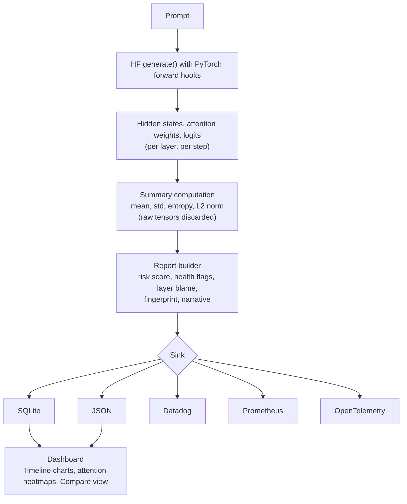

# CoreVital

**LLM inference health monitor with risk scoring, structured artifacts, and an interactive dashboard.**

CoreVital hooks into the forward pass of any Hugging Face transformer to capture hidden states, attention patterns, and logits at every generation step. Instead of storing raw tensors, it computes lightweight summary statistics and produces structured reports with a 0--1 risk score, boolean health flags, layer blame, prompt fingerprints, and human-readable narratives. Reports persist to SQLite (default), JSON, Datadog, Prometheus, or OpenTelemetry.

Use it to debug why a model repeats itself, monitor inference health in production, or compare models side by side -- all without modifying model code.

## Features

-  **Deep Instrumentation**: Capture hidden states, attention patterns, and logits at every generation step
-  **Summary Statistics**: Compute lightweight summaries (mean, std, L2 norm, entropy, etc.) instead of full tensors
-  **Performance Monitoring**: Track operation times with `--perf` flag (summary, detailed, or strict mode)
-  **Model Registry**: Single source of truth for model type detection via `ModelCapabilities`
-  **Extensible Persistence**: Pluggable Sink interface — SQLite (default), LocalFile, Datadog, Prometheus, HTTP, OpenTelemetry
-  **CI/CD**: GitHub Actions workflow with pytest, Ruff linting, and MyPy type checking
-  **Configurable**: YAML configuration with environment variable overrides
-  **CPU/CUDA Support**: Automatic device detection or manual override
-  **Quantization Support**: 4-bit and 8-bit quantization via bitsandbytes for memory-efficient inference
-  **Structured Artifacts**: JSON trace files with schema version `0.3.0` for future compatibility

**Tested with:** Llama 3 (e.g. meta-llama/Llama-3.2-1B), Mistral 7B, Mixtral 8x7B, Qwen2. See [Model compatibility](docs/model-compatibility.md) and smoke tests in `tests/test_models_production.py` (run with `pytest -m slow`).

**Status (v0.3.0, showcase branch):** Phases 0--2 (instrumentation, metrics, risk scoring) and the dashboard are fully implemented and tested. Phases 3--8 (fingerprinting, early warning, health-aware decoding, comparison, narratives, library API) have working implementations that are iterative -- functional but expected to evolve. Streaming (Phase 4) is post-run replay; real-time per-step events are planned. See [Roadmap](#roadmap).

## Try CoreVital

**Live Dashboard** -- browse real Llama-3.1 and GPT-2 traces without installing anything:

[](https://corevital-dwwtkbigm89mp5opxioez3.streamlit.app/)

The hosted dashboard ships with a curated demo database (5 traces, two models, varying risk levels). Select "Database" in the sidebar to explore.

**Install locally** (for CLI, dashboard, and production use):

```bash
pip install "git+https://github.com/Joe-b-20/CoreVital.git"
corevital run --model gpt2 --prompt "Explain why the sky is blue" --max_new_tokens 20
```

## What You Get

Every run produces a structured report. Here is a condensed example from a real GPT-2 run:

```json
{
  "risk_score": 0.35,
  "health_flags": {
    "nan_detected": false,
    "attention_collapse_detected": true,
    "high_entropy_steps": 1,
    "repetition_loop_detected": false
  },
  "narrative": "Moderate risk. Attention collapse detected in 3 heads. One high-entropy step at position 2.",
  "timeline": [
    {
      "step_index": 0,
      "token": { "token_text": " the", "prob": 0.222 },
      "entropy": 4.02,
      "perplexity": 16.22,
      "surprisal": 3.91
    }
  ],
  "fingerprint_vector": [0.35, 4.02, 0.22, 5, 12, ...]
}
```

Full reports include per-layer hidden-state and attention summaries for every generation step, prompt telemetry, layer blame, and performance breakdowns. See [Output Format](#output-format) for the complete schema.

## How It Works



## Measured Overhead

All measurements on CPU, `--perf` mode, excluding model load time:

| Model | Layers | Steps | Inference | Report build | Prompt telemetry | Total overhead |
|-------|--------|-------|-----------|-------------|-----------------|---------------|
| flan-t5-small | 8 | 8 | 709 ms | 164 ms | -- | +23% |
| Phi-3-mini-4k | 32 | 50 | 3,347 ms | 1,652 ms | 687 ms | +70% |
| Llama-3.1-8B | 32 | 50 | 4,183 ms | 1,578 ms | 1,084 ms | +64% |

Report building scales as O(steps x layers x heads). For production use, `--capture summary` skips per-layer data and drops overhead to under 5%. `--capture on_risk` records a full trace only when risk exceeds a threshold.

## Quick Start

### Installation

```bash
# Install from GitHub
pip install "git+https://github.com/Joe-b-20/CoreVital.git"

# Or clone and install in editable mode (for development)
git clone https://github.com/Joe-b-20/CoreVital.git
cd CoreVital
pip install -e .
```

Optional extras: `pip install "CoreVital[dashboard]"` (Streamlit dashboard), `pip install "CoreVital[otel]"` (OpenTelemetry), `pip install "CoreVital[all]"` (everything).

### Basic Usage
```bash
# Run monitoring on GPT-2 (CausalLM) with a simple prompt
corevital run \
  --model gpt2 \
  --prompt "Explain why the sky is blue" \
  --max_new_tokens 50 \
  --device auto

# Run monitoring on T5 (Seq2Seq) model
corevital run \
  --model google/flan-t5-small \
  --prompt "My code works and I have no idea why" \
  --max_new_tokens 20 \
  --device auto

# Run with 4-bit quantization (requires CUDA)
corevital run \
  --model gpt2 \
  --prompt "Explain why the sky is blue" \
  --max_new_tokens 50 \
  --device cuda \
  --quantize-4

# Run with 8-bit quantization (requires CUDA)
corevital run \
  --model gpt2 \
  --prompt "Explain why the sky is blue" \
  --max_new_tokens 50 \
  --device cuda \
  --quantize-8

# Run with performance monitoring (summary mode)
corevital run --model gpt2 --prompt "Hello world" --perf

# Run with detailed performance breakdown
corevital run --model gpt2 --prompt "Hello world" --perf detailed

# Run with strict mode (includes warmup and baseline measurements)
corevital run --model gpt2 --prompt "Hello world" --perf strict

# Default: output is saved to runs/corevital.db (SQLite); no JSON file unless you pass --write-json.
# Use --sink local for JSON in runs/; add --json-pretty for indented (larger) JSON.
```

> **Tip:** `corevital` is the installed CLI command. You can also use `python -m CoreVital.cli` if running from source without installing.

### Library API (CoreVitalMonitor)

Use the embeddable monitor for programmatic runs and post-run risk checks:

```python
from CoreVital import CoreVitalMonitor

monitor = CoreVitalMonitor(capture_mode="summary", intervene_on_risk_above=0.8)
monitor.run("gpt2", "Explain quantum tunneling.", max_new_tokens=20)
# For large models use 4-bit: monitor.run("meta-llama/Llama-3.1-8B", prompt, load_in_4bit=True, device="cuda")

print("Risk score:", monitor.get_risk_score())
print("Health flags:", monitor.get_health_flags())
if monitor.should_intervene():
    print("Consider resampling or lowering temperature.")

# Or use the context manager
with monitor.wrap_generation("gpt2", "Hello world") as m:
    summary = m.get_summary()  # risk_score, health_flags, fingerprint, narrative

# Async stream (per-step events after run; v1 = post-run replay)
import asyncio
async def main():
    monitor = CoreVitalMonitor(capture_mode="summary")
    async for event in monitor.stream("gpt2", "Say hi.", max_new_tokens=5):
        print(event["step_index"], event["token_text"], event.get("entropy"))
asyncio.run(main())
```

### CLI commands

- **`run`** — Run instrumented generation (default sink: SQLite at `runs/corevital.db`).
- **`migrate`** — Migrate `trace_*.json` files from a directory into a SQLite DB (`corevital migrate --from-dir runs --to-db runs/corevital.db`).
- **`compare`** — Summarize runs by model from a SQLite DB (`corevital compare --db runs/corevital.db`).

### CLI Options (run)
```bash
corevital run --help

Options:
  --model TEXT              Hugging Face model ID (required)
  --prompt TEXT             Input prompt text (required)
  --max_new_tokens INT      Number of tokens to generate [default: 20]
  --device TEXT             Device: auto|cpu|cuda [default: auto]
  --seed INT                Random seed [default: 42]
  --temperature FLOAT       Sampling temperature [default: 0.8]
  --top_k INT               Top-k sampling [default: 50]
  --top_p FLOAT             Top-p sampling [default: 0.95]
  --quantize-4              Load model with 4-bit quantization (requires CUDA)
  --quantize-8              Load model with 8-bit quantization (requires CUDA)
  --out PATH                Output directory (default: runs); with --sink sqlite, DB is <out>/corevital.db
  --sink TEXT               Sink: sqlite (default) | local | datadog | prometheus
  --capture TEXT            Capture mode: summary | full | on_risk
  --rag-context PATH        Path to JSON file with RAG context metadata
  --export-otel             Export run to OpenTelemetry (OTLP); requires pip install CoreVital[otel]
  --otel-endpoint HOST:PORT OTLP gRPC endpoint (or set OTEL_EXPORTER_OTLP_ENDPOINT)
  --config PATH             Path to custom config YAML file
  --log_level TEXT          Logging level: DEBUG|INFO|WARNING|ERROR [default: INFO]
  --perf [MODE]             Performance monitoring: summary (default), detailed, or strict
```

## Output Format

Each run produces a structured report with schema version `0.3.0`. Reports are stored in SQLite by default (`runs/corevital.db`). Use `--sink local` for individual JSON files, or `--write-json` with SQLite to get both.

**Schema upgrade note:** v0.3.0 adds health_flags, extensions (risk, fingerprint, early_warning, narrative, performance), and prompt telemetry fields that did not exist in v0.2.0. Old v0.2.0 traces remain readable but will not contain these fields. Use `corevital migrate` to import legacy JSON traces into the SQLite database.

Report structure:
```json
{
  "schema_version": "0.3.0",
  "trace_id": "uuid-here",
  "created_at_utc": "2026-01-11T15:22:08Z",
  "model": {
    "hf_id": "gpt2",
    "architecture": "GPT2LMHeadModel",
    "dtype": "float32",
    "device": "cpu",
    "quantization": { "enabled": false, "method": null }
  },
  "run_config": { ... },
  "prompt": {
    "text": "...",
    "token_ids": [...],
    "num_tokens": 10
  },
  "generated": {
    "output_text": "...",
    "token_ids": [...],
    "num_tokens": 50
  },
  "timeline": [
    {
      "step_index": 0,
      "token": { "token_id": 123, "token_text": "hello", "is_prompt_token": false },
      "logits_summary": { "entropy": 8.12, "top1_top2_margin": 0.34, "topk": [...] },
      "layers": [
        {
          "layer_index": 0,
          "hidden_summary": { "mean": 0.001, "std": 0.98, ... },
          "attention_summary": { "entropy_mean": 2.31, ... },
          "cross_attention": { "entropy_mean": 0.92, ... },
          "extensions": {}
        }
      ],
      "extensions": {}
    }
  ],
  "summary": {
    "prompt_tokens": 10,
    "generated_tokens": 50,
    "total_steps": 60,
    "elapsed_ms": 1234
  },
  "warnings": [],
  "health_flags": { "nan_detected": false, "high_entropy_steps": 0, ... },
  "extensions": { "risk": { "risk_score": 0.2, "risk_factors": [] }, "fingerprint": { ... }, "narrative": { ... } },
  "encoder_layers": [
    {
      "layer_index": 0,
      "hidden_summary": { "mean": 0.5, "std": 1.2, ... },
      "attention_summary": { "entropy_mean": 2.85, ... },
      "cross_attention": null,
      "extensions": {}
    }
  ]
}
```

### Key Components

- **prompt**: Contains the input prompt text, number of tokens and token IDs
- **generated**: Contains the generated output text, number of tokens and token IDs
- **timeline**: Per-token trace covering generated tokens. Each step contains decoder layer summaries.
- **hidden_summary**: Mean, std, L2 norm, max abs value, and random projection sketch
- **attention_summary**: Entropy statistics (entropy_mean, entropy_min) and concentration metrics (concentration_max). 
  - For decoder layers (in timeline): Contains decoder self-attention
  - For encoder layers (in encoder_layers): Contains encoder self-attention
  - This field ALWAYS contains self-attention, regardless of model type
- **cross_attention**: (Seq2Seq only) Cross-attention statistics showing how the decoder attends to encoder outputs at each generation step. Only used in decoder layers (in timeline). Always null for CausalLM models and for encoder layers.
- **encoder_layers**: (Seq2Seq only) Encoder layer summaries computed once at the start of generation. Each layer includes `hidden_summary` and `attention_summary` (encoder self-attention). Always null for CausalLM models.
- **logits_summary**: Entropy, top-1/top-2 margin, and top-k token probabilities
- **model.dtype**: Model dtype as string. `Optional[str]` — may be `null` or `"quantized_unknown"` when dtype cannot be definitively detected for quantized models.
- **model.revision**: Model commit hash/revision extracted from model config
- **model.quantization**: Quantization information (enabled: bool, method: "4-bit"|"8-bit"|null). The dtype field shows quantized dtypes (int8, uint8) when detectable, or `"quantized_unknown"` otherwise.
- **health_flags**: Aggregated flags (nan_detected, attention_collapse_detected, high_entropy_steps, repetition_loop_detected, etc.).
- **extensions**: Risk (risk_score, risk_factors, blamed_layers), fingerprint (vector, prompt_hash; when available), early_warning (when available), narrative, RAG, performance.

### Trace File Sizes

Trace files are saved in **compact JSON format** (no indentation, minimal separators) for smaller file sizes. Typical file sizes:

- **Small models (GPT-2, 12 layers, ~15 steps):** 200-600 KB on disk
- **Medium models (Llama-3.1-8B, 32 layers, ~50 steps):** 1.3-1.5 MB on disk (compact JSON)
- **Large models (more layers/steps):** Up to ~5 MB depending on attention sparsity

**Optimizations applied:**
- **Compact JSON:** No indentation, minimal separators (`separators=(",", ":")`) — saves ~63% vs pretty-printed
- **Exclude None fields:** Optional fields set to `None` are omitted from JSON — saves ~19 KB per file
- **Sparse attention storage:** Only attention weights above threshold are stored — saves ~680× vs naive approach

**Note:** If you want to inspect the JSON in a formatted way, use the dashboard's "Raw JSON" section which provides a toggle for pretty-printing. For even smaller files, consider gzip compression (typically achieves 70-80% reduction).

The storage is dominated by **sparse attention profiles** from prompt telemetry (Phase-1b), which store only attention weights above a threshold. Typical storage: **0.5-5 MB** depending on attention patterns (documented in `docs/Phase1 metrics analysis.md`).

### Performance Monitoring (`--perf`)

The `--perf` flag enables performance monitoring with three modes:

**Summary Mode** (`--perf` or `--perf summary`):
- Adds `performance` extension to the main trace JSON
- Shows total wall time and breakdown by parent operations
- Tracks: config_load, setup_logging, model_load, torch.manual_seed, tokenize, model_inference, report_build

**Detailed Mode** (`--perf detailed`):
- Everything in summary mode, plus:
- Creates a separate `*_performance_detailed.json` file
- Shows nested breakdown with child operations and per-step statistics
- Useful for identifying specific bottlenecks

**Strict Mode** (`--perf strict`):
- Everything in detailed mode, plus:
- Runs warmup before measurements to stabilize GPU timing
- Runs baseline (uninstrumented) inference for comparison
- Reports original model load time (before caching)
- Calculates inference overhead and CoreVital overhead percentages

Example performance output in summary:
```json
{
  "extensions": {
    "performance": {
      "total_wall_time_ms": 2500.0,
      "parent_operations": [
        {"name": "config_load", "ms": 3.0, "pct": 0.12},
        {"name": "model_load", "ms": 1700.0, "pct": 68.0},
        {"name": "model_inference", "ms": 700.0, "pct": 28.0}
      ],
      "unaccounted_time": {"ms": 2.0, "pct": 0.08},
      "detailed_file": "runs/trace_abc123_performance_detailed.json"
    }
  }
}
```

### Model Compatibility

See [docs/model-compatibility.md](docs/model-compatibility.md) for tested models, attention capture details, quantization notes, and Seq2Seq support.

## Architecture

CoreVital instruments LLM inference by hooking into the model's forward pass, extracting internal tensors (hidden states, attention weights, logits), and computing lightweight summary statistics. The architecture is designed for production use with minimal overhead and storage requirements.

### System Overview

- **Instrumentation Layer**: PyTorch hooks capture tensors during model forward pass
- **Summary Computation**: Lightweight statistics (mean, std, entropy, norms) computed in-memory
- **Report Building**: Structured JSON reports with schema versioning
- **Pluggable Sinks**: Multiple persistence backends (SQLite, local files, Datadog, Prometheus, OTLP)

**Architecture Diagrams:**
- [Data Flow](docs/mermaid/metrics-data-flow.mmd) — How data flows from model inference to reports
- [Computation Pipeline](docs/mermaid/phase-1-computation-pipeline.mmd) — Phase-1 metrics computation flow
- [Schema Structure](docs/mermaid/schema-v03-structure.mmd) — Report schema v0.3.0 organization
- [Metrics Dependency Chain](docs/mermaid/metrics-dependency-chain.mmd) — How metrics depend on each other
- [Signal Interpretation](docs/mermaid/metrics-signal-interpretation.mmd) — What each metric means
- [Performance Monitoring](docs/mermaid/operations-hierarchy.mmd) — Operation timing hierarchy
- [Execution Flow](docs/mermaid/operations-flow-sequential.mmd) — Sequential execution order
- [Extensions Computation](docs/mermaid/extensions-computation-flow.mmd) — How risk, fingerprint, narrative, and early_warning are computed

**Production Deployment:** See [Production Deployment Guide](docs/production-deployment.md) for sampling strategies, database setup, metrics export, and alerting.

**Integration Examples:** See [Integration Examples](docs/integration-examples.md) for Flask, FastAPI, and production patterns.

**Visual Examples:** See [Visual Examples Guide](docs/visual-examples.md) for interpreting dashboard metrics and identifying healthy vs unhealthy runs.

### Sink Interface

The Sink interface allows pluggable persistence backends:
```python
from CoreVital.sinks.base import Sink
from CoreVital.reporting.schema import Report

class CustomSink(Sink):
    def write(self, report: Report) -> str:
        # Your custom persistence logic
        return "location_identifier"
```

Built-in sinks:
- **SQLiteSink** (default): One SQLite DB per run directory; supports `list_traces()`, filters by model_id/prompt_hash. Use `--sink sqlite`.
- **LocalFileSink**: Write JSON to local filesystem (`--sink local`).
- **DatadogSink**: Send metrics/events to Datadog (`--sink datadog`; requires `DD_API_KEY` or `--datadog_api_key`).
- **PrometheusSink**: Expose `/metrics` for scraping (`--sink prometheus`; `--prometheus_port`).
- **HTTPSink**: POST JSON to remote endpoint.

### Configuration

Override defaults via `configs/default.yaml` or environment variables:
```bash
export COREVITAL_DEVICE=cuda
export COREVITAL_SEED=123
```

## Performance

See [Measured Overhead](#measured-overhead) for real numbers. Key optimization levers:

- **`--capture summary`**: Skips per-layer data; overhead drops to under 5%.
- **`--capture on_risk`**: Summary by default, full trace only when risk exceeds threshold.
- **Sampling**: Instrument a subset of requests (1% random, every N-th).
- **Skip prompt telemetry**: `--no-prompt-telemetry` removes the extra forward pass.

See [Design Journey](docs/design-journey.md) for the performance monitoring design rationale.

## Comparison with Alternatives

CoreVital focuses on **internal inference health monitoring**—instrumenting the model's forward pass to detect issues like repetition loops, attention collapse, and numerical anomalies. Here's how it compares:

| Tool | Focus | Internal Instrumentation | Health Signals | Storage Model |
|------|-------|-------------------------|----------------|---------------|
| **CoreVital** | Internal inference health | Yes (hooks into forward pass) | Entropy, repetition, attention collapse, NaN/Inf | Summary-only (no raw tensors) |
| **LangSmith** | LLM application tracing | No (API-level only) | Output quality scores | Full traces (prompts/responses) |
| **OpenLIT / Langtrace** | LLM observability | No (OpenTelemetry at API level) | Latency, cost, token counts | Request/response traces |
| **Aporia** | AI observability & guardrails | No (application-level) | Output guardrails, drift | Application metrics |
| **Langfuse** | LLM tracing & evals | No (API-level tracing) | Eval scores on outputs | Full traces |

**CoreVital's differentiator:** Only CoreVital instruments **inside** the model's forward pass to capture hidden states, attention patterns, and logits during generation. This enables detection of issues that manifest internally (e.g., attention collapse, repetition loops) before they appear in outputs.

**When to use CoreVital:**
- You're running self-hosted/open-source models (Hugging Face transformers)
- You need to debug why models fail (repetition, confusion, numerical issues)
- You want to monitor model health in production without storing raw activations
- You need to compare models or track degradation over time

**When to use alternatives:**
- You're using API-based LLMs (OpenAI, Anthropic) -- use LangSmith/OpenLIT
- You need application-level tracing -- use Langfuse/Langtrace
- You need output guardrails -- use Aporia

See [Competitive Landscape](docs/competitive-landscape.md) for detailed analysis.

## Use Cases

See [Case Studies](docs/case-studies/) for real-world examples of CoreVital in production.

### 1. Debugging Model Failures

**Problem:** Model produces repetitive or nonsensical output, but you don't know why.

**Solution:** Run CoreVital to see:
- **Repetition loop detected:** Last-layer hidden states became nearly identical -- model is stuck
- **High entropy steps:** Model was confused at specific tokens -- check input context
- **Attention collapse:** Some heads put all weight on one token -- possible training issue
- **NaN/Inf detected:** Numerical instability -- check inputs or model weights

**Example:**
```bash
corevital run --model meta-llama/Llama-3.1-8B \
  --prompt "Explain quantum computing" \
  --max_new_tokens 100 \
  --perf detailed
# Check dashboard for risk score, health flags, and timeline
```

### 2. Production Monitoring

**Problem:** Monitor model health in production without storing massive tensor dumps.

**Solution:** Use `--capture summary` or `--capture on_risk` to get lightweight health signals:
- Risk score per run
- Health flags (NaN, repetition, attention collapse)
- Time series (entropy, perplexity) for trend analysis

**Example:**
```python
from CoreVital import CoreVitalMonitor

monitor = CoreVitalMonitor(capture_mode="summary")
monitor.run("gpt2", user_prompt, max_new_tokens=50)

if monitor.should_intervene():
    # Resample or fallback to another model
    pass
```

### 3. Model Comparison

**Problem:** Compare how different models or configurations perform on the same prompts.

**Solution:** Run CoreVital on multiple models, then use the dashboard's Compare view or `corevital compare`:
- Risk scores across models
- Health flags comparison
- Entropy/perplexity trends
- Performance overhead

**Example:**
```bash
# Run on model A
corevital run --model gpt2 --prompt "..." --sink sqlite

# Run on model B
corevital run --model meta-llama/Llama-3.2-1B --prompt "..." --sink sqlite

# Compare
corevital compare --db runs/corevital.db
# Or use dashboard Compare view
```

### 4. Research & Analysis

**Problem:** Analyze model behavior across different prompts or configurations.

**Solution:** Use CoreVital's detailed reports to study:
- Attention patterns (sparse attention profiles)
- Layer transformations (how representations change)
- Entropy profiles (confidence over generation)
- Basin scores (attention focus on prompt middle)

**Example:** See [Phase-1 Metrics Analysis](docs/Phase1%20metrics%20analysis.md) for research-backed metric interpretations.

## Glossary

**Hidden States:** Internal representations computed by each transformer layer. Shape: `(batch, sequence_length, hidden_dim)`. CoreVital summarizes these as mean, std, L2 norm, max absolute value.

**Attention Patterns:** Weights showing which tokens each attention head focuses on. Shape: `(batch, heads, seq_len, seq_len)`. CoreVital computes entropy statistics (how spread out attention is) and detects collapse (heads focusing on one token).

**Logits:** Raw model outputs before softmax, representing scores for each token in the vocabulary. CoreVital computes entropy (uncertainty), perplexity, surprisal, and top-k margins.

**Entropy:** Measure of uncertainty in probability distributions. Low entropy = confident (peaked distribution), high entropy = uncertain (flat distribution). Range: 0 to ~16-17 for typical LLMs.

**Perplexity:** Exponential of entropy. Roughly "how many tokens the model is choosing between." Low perplexity (1-4) = confident, high perplexity (>16) = very uncertain.

**Surprisal:** Negative log probability of the actual token. High surprisal = model was surprised by the token it produced.

**Attention Collapse:** When an attention head puts almost all weight (>0.95) on a single token. Can indicate training issues or model degradation.

**Repetition Loop:** When the model gets stuck repeating the same tokens. Detected by comparing last-layer hidden states across steps (high cosine similarity indicates repetition).

**Risk Score:** Single number (0-1) summarizing overall run health. Computed from health flags, entropy patterns, and attention anomalies. Higher = more likely to produce poor output.

**Health Flags:** Boolean indicators for specific issues: NaN/Inf detected, attention collapse, high entropy steps, repetition loop, mid-layer anomaly.

**Prompt Telemetry:** Extra forward pass over the prompt (before generation) to analyze how the model processes input. Captures layer transformations, attention patterns, and surprisal.

**Cross-Attention:** (Seq2Seq only) How the decoder attends to encoder outputs. Shows which parts of the input the model "listens to" during generation.

**Voter Agreement:** Fraction of top-k tokens whose cumulative probability exceeds a threshold. High voter agreement means the model's top candidates all point the same direction. Low voter agreement suggests the model is split between very different continuations.

**Basin Scores:** Measure of how much each attention head focuses on nearby (local) tokens versus distant ones. High basin score = head attends mostly to neighbors (local pattern). Low basin score = head attends broadly across the sequence (global pattern). Useful for detecting degenerate attention that ignores positional structure.

**Layer Transformations:** Geometric change between consecutive layers' hidden state representations. Computed as the ratio of L2 norms (magnitude change) and cosine similarity (direction change) between layer N and layer N+1. Large magnitude jumps or sharp direction changes can indicate layers where the model "makes decisions."

**Mid-Layer Anomaly:** L2 norm explosion detected specifically in the middle third of model layers. Research (e.g., Meng et al.) suggests middle layers are where factual recall and "truth processing" occur. Anomalies here may indicate the model is struggling with factual content.

**Concentration:** The maximum attention weight any single token receives from a query in an attention head. High concentration (>0.5) means the head is "focused" on specific tokens. Extremely high concentration (>0.95) indicates potential attention collapse.

**Fingerprint:** A compact 9-element numeric vector summarizing a run's behavior (mean/max entropy, risk score, health flag booleans). Used for clustering similar runs and detecting patterns. Includes a SHA256 prompt hash for exact duplicate detection.

**L2 Norm:** The Euclidean length (magnitude) of a vector. In CoreVital, L2 norm of hidden states tracks how "large" representations become across layers and steps. Sudden L2 norm growth ("explosion") can indicate numerical instability.

## Development

### Running Tests
```bash
# Run all tests (excluding GPU tests)
pytest tests/ -v --tb=short -m "not gpu"

# Run smoke test only
pytest tests/test_smoke_gpt2_cpu.py -v

# Run mock instrumentation tests (fast, no model loading)
pytest tests/test_mock_instrumentation.py -v

# Run performance monitoring tests
pytest tests/test_performance.py -v

# Run with coverage
pytest --cov=CoreVital tests/
```

### Linting & Formatting (Ruff)
```bash
# Check for lint errors
ruff check src/ tests/

# Auto-fix lint errors
ruff check src/ tests/ --fix

# Check formatting
ruff format --check src/ tests/

# Auto-format
ruff format src/ tests/
```

Ruff is configured in `pyproject.toml` with rules: `["E", "F", "I", "W", "B"]` (includes flake8-bugbear).

### Type Checking (MyPy)
```bash
mypy src/CoreVital/ --ignore-missing-imports --warn-return-any --warn-unused-configs
```

### CI/CD

GitHub Actions runs on every push and pull request to `main`:
- **Lint & Format**: Ruff check + format verification
- **Type Check**: MyPy static analysis
- **Test**: pytest suite (Python 3.12)

### Hosting the Dashboard

The Streamlit dashboard can be hosted publicly via [Streamlit Community Cloud](https://share.streamlit.io):

1. Sign in at [share.streamlit.io](https://share.streamlit.io) with the GitHub account that owns this repo.
2. Click **New app**, select the `CoreVital` repo, branch `main`, main file `dashboard.py`.
3. Deploy. The `requirements.txt` at the repo root handles all dependencies.

The bundled demo database (`docs/demo/corevital_demo.db`) ships with 5 curated traces (GPT-2 and Llama-3.1-8B-Instruct at varying risk levels). On the hosted app, select **Database** in the sidebar to browse them -- no local setup required.

To use your own database, copy `runs/corevital.db` into the repo (or update the SQLite path in the sidebar).

### Mock Testing Suite

The project includes a comprehensive mock testing suite that allows testing instrumentation logic without loading heavy models. This enables fast, lightweight testing of the instrumentation pipeline.

**Mock Fixtures** (`tests/conftest.py`):
- `mock_model_bundle`: Provides a mock `ModelBundle` with configurable model and tokenizer
- Supports both CausalLM and Seq2Seq architectures via parametrization
- Returns properly shaped tensors for all outputs (hidden states, attentions, cross-attentions)

**Mock Tests** (`tests/test_mock_instrumentation.py`):
- Tests `InstrumentationCollector` with mock models
- Tests `ReportBuilder` produces valid JSON reports
- Verifies tensor shapes for both Causal and Seq2Seq models
- Full pipeline integration tests

Usage:
```bash
# Test CausalLM mocks
pytest tests/test_mock_instrumentation.py::TestMockCausalLMInstrumentation -v

# Test Seq2Seq mocks
pytest tests/test_mock_instrumentation.py::TestMockSeq2SeqInstrumentation -v

# Test full pipeline
pytest tests/test_mock_instrumentation.py::TestMockInstrumentationIntegration -v
```

### Project Structure

- `src/CoreVital/`: Main package
  - `models/`: Model loading, management, and `ModelCapabilities` registry
  - `instrumentation/`: Hooks, collectors, summary computation, and performance monitoring
  - `reporting/`: Schema (v0.3.0), validation, and report building
  - `sinks/`: Persistence backends (SQLite, LocalFile, HTTP, Datadog, Prometheus)
  - `utils/`: Shared utilities
- `.github/workflows/`: CI/CD pipeline (test.yaml)
- `configs/`: YAML configuration files
- `runs/`: Default output directory for trace artifacts
- `tests/`: Test suite

## Roadmap

Phases 0--2 and the dashboard are fully implemented and tested. Phases 3--8 have working implementations that are iterative. See [Design Journey](docs/design-journey.md) for architectural decisions and trade-offs.

| Phase | Focus | Key deliverables |
|-------|-------|-----------------|
| Phase 0 | HF instrumentation | Hidden states, attention, logits capture; summaries; Seq2Seq; quantization |
| Phase 0.5 | Hardening | Extensions model, encoder/decoder separation, memory optimizations |
| Phase 0.75 | Performance monitoring | `--perf` (summary/detailed/strict); operation timing; warmup/baseline |
| Pre-Phase-1 | Cleanup and tooling | Schema v0.3.0, `ModelCapabilities` registry, CI/CD, dtype detection |
| Phase 1 | Metrics and telemetry | Enhanced metrics, prompt telemetry, health flags, dashboard, SQLite default |
| Phase 2 | Risk scoring | `compute_risk_score`, `compute_layer_blame`; `on_risk` capture trigger |
| Phase 3 | Fingerprinting | `compute_fingerprint_vector`, `compute_prompt_hash` |
| Phase 4 | Early warning | `compute_early_warning`; streaming API |
| Phase 5 | Health-aware decoding | `should_intervene()`; configurable risk threshold |
| Phase 6 | Cross-model comparison | Dashboard Compare view; `corevital compare`; SQLite filters |
| Phase 7 | Narratives | Template-based `build_narrative` |
| Phase 8 | Packaging | Dashboard polish; Library API (`CoreVitalMonitor`); OpenTelemetry integration |

## Known Limitations & What's Next

CoreVital v0.3.0 is a working implementation of internal inference monitoring for Hugging Face transformers. The following are known limitations and planned improvements — contributions welcome.

### Serving Framework Support

CoreVital currently instruments models loaded via Hugging Face `transformers` (`AutoModelForCausalLM`, `AutoModelForSeq2SeqLM`). It does **not** yet support optimized serving frameworks:

- **vLLM** — Uses PagedAttention and custom CUDA kernels that bypass standard PyTorch forward hooks. Integration would require vLLM's `SamplerOutput` hooks or a custom sampler plugin.
- **TGI (Text Generation Inference)** — Rust/Python hybrid server; would need a middleware layer that captures activations before the optimized kernels.
- **llama.cpp / GGUF** — C++ inference with quantized formats outside PyTorch; out of scope for the current hook-based approach.

**Path forward:** Abstract the instrumentation interface so backends other than HF `transformers` can plug in. vLLM's `Logprob` output and custom `LogitsProcessor` are likely starting points.

### Real-Time Intervention

The `should_intervene()` API and early warning system currently operate **post-run** — they analyze the complete generation after it finishes. Real-time per-step intervention (halting generation mid-stream when risk exceeds a threshold) is architecturally supported by the manual decoder loop in `collector.py` but not yet wired:

- The decoder loop already computes summaries per step.
- Health flags could be evaluated incrementally.
- A `StopCondition` callback that checks risk per step is the planned approach.

**Status:** Streaming API (Phase 4) currently replays steps post-run. Real-time per-step events with mid-generation halt are the next major feature.

### Risk Threshold Calibration

Risk scores and health flag thresholds (`risk.py`, `report_builder.py`) are hand-crafted heuristics based on observed model behavior during development:

- NaN/Inf → risk 1.0 (always catastrophic)
- Repetition loop → 0.9 (strong indicator of degenerate output)
- Mid-layer anomaly → 0.7 (suggests factual processing failure)
- Attention collapse → 0.3 (common in healthy runs; not always problematic)
- High entropy threshold: 4.0 bits (see comment in `report_builder.py`)

These have **not** been validated on a large labeled dataset of good vs. bad generations. Calibration against benchmarks (e.g., TruthfulQA, HaluEval) is planned.

### Decoding Strategies

The manual decoder loop supports **greedy decoding** and **sampling** (temperature, top-k, top-p). **Beam search** is not implemented — it requires tracking multiple hypotheses simultaneously, which complicates per-step instrumentation. Most production LLM deployments use sampling, but beam search support may be added if there is demand.

### GPU Overhead Benchmarks

The [Measured Overhead](#measured-overhead) table reports numbers for GPT-2 on CPU. Benchmarks on production-scale models (Llama-3.1-8B, Mixtral-8x7B) with GPU are planned and will be added to the table. Early testing suggests overhead is dominated by `output_attentions=True` (attention weight materialization) rather than CoreVital's summary computation.

## Requirements

- Python 3.12+
- PyTorch
- Transformers (Hugging Face)
- PyYAML
- Pydantic

**Optional extras** (e.g. `pip install "CoreVital[dashboard]"`):
- `quantization`: bitsandbytes + accelerate for 4-bit / 8-bit inference (requires CUDA)
- `dashboard`: Streamlit + Plotly for the web dashboard
- `datadog`: Datadog API client for `--sink datadog`
- `prometheus`: Prometheus client for `--sink prometheus`
- `otel`: OpenTelemetry SDK + OTLP exporter for `--export-otel`
- `all`: everything above

**Dev dependencies** (`pip install "CoreVital[dev]"`):
- pytest
- ruff
- mypy

## License

Apache 2.0

## Contributing

Contributions welcome! Please open an issue or PR.