# CoreVital Validation Report

Primary technical validation report for the CoreVital repo: evidence that internal signals predict task correctness and failure on labeled benchmarks under grouped held-out evaluation.

**Run identifier:** Analysis timestamp `2026-03-13T13:16:59.654245+00:00` (from `experiment/analysis/global_manifest.json`). Numbers in this report refer to this run.

**Report generated:** 2026-03-13.

---

## Table of contents

1. [Experiment design](#1-experiment-design)
2. [Results](#2-results)
   - [Metric correlation (Focus 1)](#metric-correlation-focus-1)
   - [MoE vs Dense (Focus 2)](#moe-vs-dense-focus-2)
   - [Self-consistency (Focus 3)](#self-consistency-focus-3)
   - [Layer analysis (Focus 4)](#layer-analysis-focus-4)
   - [Difficulty profiling (Focus 5)](#difficulty-profiling-focus-5)
   - [Cross-model alignment (Focus 6)](#cross-model-alignment-focus-6)
   - [Signal ablation](#signal-ablation)
   - [Ranking (best-of-k)](#ranking-best-of-k)
   - [Confidence calibration](#confidence-calibration)
   - [Outcome profiling (three-way signatures)](#outcome-profiling-three-way-signatures)
   - [Temperature robustness](#temperature-robustness)
   - [Difficulty-stratified analysis](#difficulty-stratified-analysis)
   - [Format failure](#format-failure)
3. [Risk calibration](#3-risk-calibration)
   - [Built-in risk_score (step 1)](#built-in-risk_score-step-1)
   - [Built-in failure_risk (step 1)](#built-in-failure_risk-step-1)
   - [Data-driven failure model (step 5)](#data-driven-failure-model-step-5)
   - [Per-model transfer (step 6)](#per-model-transfer-step-6)
   - [Calibration figures](#calibration-figures)
4. [Methodology notes](#4-methodology-notes)
5. [Limitations](#5-limitations)
   - [Risk score and early warning](#risk-score-and-early-warning)
6. [Next steps](#6-next-steps)
7. [Data references](#7-data-references)
8. [Glossary](#8-glossary)
9. [Reproducibility](#9-reproducibility)
10. [Figure inventory](#10-figure-inventory)

---

## Executive summary

- **CoreVital's internal signals predict task correctness** on GSM8K and HumanEval under **grouped held-out evaluation**:
  - **Ablation (HistGradientBoosting):** T6 AUROC 0.60-0.90 across model/dataset cells. Biggest gains vary by task: early-window features (T4) drive HumanEval; prompt signals (T3) help GSM8K.
  - **Pooled logistic regression (step 5):** AUROC 0.744, ECE 0.164 (6 features vs ablation's 104).
  - **Key nuance:** Models are catastrophically overconfident, but CoreVital signals still discriminate (confident-but-wrong AUROC up to 0.92).

- **Three-way outcome finding:** Correct, incorrect, and format-failure have distinct, architecture-dependent signatures.

- **Temperature-robust:** Signals stable across temperatures (mean predictive power shift 0.028).

- **Built-in scores are not production-calibrated:** **risk_score** saturates at 1.0 (Mistral 96%, Mixtral 94%); ECE 0.24-0.70; AUROC 0.48-0.62. **failure_risk** is discrete (2-5 unique values), AUROC near chance.

- **Format failure** (GSM8K missing `####`) is predictable: Mistral 72%, Mixtral 62% failure rate.

- **Honest caveat:** The pooled learned model (step 5) is promising pooled, but per-model step 6 results are **mixed**; do **not** present it as a universal replacement. Use per-model calibration instead.

---

## Main results table

Per (model, dataset): prompts, runs, accuracy (correct / total runs), format-failure rate, T6 (full_corevital) ablation AUROC, and step-1 ECE (raw vs calibrated). Sources: `experiment/results/grades.jsonl`, `experiment/analysis/RESULTS_SUMMARY.md`, `experiment/calibration/step1_ece_results.json`, `experiment/analysis/ablation/tables/ablation_ablation_summary.csv`.

| Model     | Dataset   | Prompts | Runs | Accuracy (%) | Format fail (%) | T6 AUROC (full_corevital) | ECE raw | ECE calibrated |
|-----------|-----------|---------|------|--------------|-----------------|---------------------------|---------|----------------|
| llama     | gsm8k     | 200     | 2000 | 65.7         | 17.9            | 0.635                     | 0.239   | 0.003          |
| llama     | humaneval | 164     | 1640 | 28.0         | 0.0             | 0.613                     | 0.304   | 0.004          |
| mistral7b | gsm8k     | 200     | 2000 | 16.0         | 72.2            | 0.670                     | 0.559   | 0.0003         |
| mistral7b | humaneval | 164     | 1640 | 6.3          | 0.0             | 0.766                     | 0.066   | 0.004          |
| mixtral   | gsm8k     | 201¹    | 2000¹| 26.8         | 62.1            | 0.650                     | 0.696   | 0.009          |
| mixtral   | humaneval | 162     | 1620 | 4.1          | 0.0             | 0.820                     | 0.048   | 0.007          |
| qwen      | gsm8k     | 200     | 2000 | 23.2         | 4.5             | 0.603                     | 0.349   | 0.001          |
| qwen      | humaneval | 164     | 1640 | 9.9          | 0.0             | 0.900                     | 0.479   | 0.020          |

¹ *mixtral/gsm8k:* nominal design is 200 prompts × 10 = 2000 runs. Part 0 source (grades.jsonl) gives **2000** total runs; this cell has **201** prompts (vs nominal 200). Some artifacts (e.g. RESULTS_SUMMARY.md, extraction_summary.md) report 2001 runs—unresolved discrepancy; 2001 is not verified from Part 0 source. See Part 0 verification log.

---

## 1. Experiment design

This section describes the validation experiment so a reader can reproduce it. All counts and design parameters are taken from `experiment/scripts/run_experiment.py`, `experiment/analysis/RESULTS_SUMMARY.md`, and Part 0 verification; where artifact counts differ from the nominal design for a specific (model, dataset) cell, the anomaly is noted rather than normalized.

**Pass@k.** For each (model, prompt) we run **k = 10** generations: 5 at temperature 0.7 and 5 at temperature 0.8, with seeds 0–9. Generation uses sampling with `top_p` 0.95, `top_k` 50, and `max_new_tokens` 768. Each run captures CoreVital traces; outputs are graded and written to `experiment/results/grades.jsonl`.

**Datasets.**

- **GSM8K:** Nominally **200 prompts**. Grading: the model must produce a final numerical answer on the last line preceded by `####`; we extract the value with a regex and compare to the gold answer. If no `####`-preceded answer is found, the run is marked **format_failure** (ungradable). Correctness is then computed only among runs that are not format failures.
- **HumanEval:** Nominally **164 prompts**. Grading: we execute the generated code in a **sandboxed** Python subprocess (function body from the model plus prompt and test cases); success is determined by test execution (return code). HumanEval runs in this experiment are not marked format_failure.

Where the verified artifact counts differ from the nominal design for a given cell, we keep the actual counts in the main results table (e.g. mixtral/gsm8k: 201 prompts, 2000 runs from grades.jsonl—other artifacts may show 2001 runs, an unresolved discrepancy; mixtral/humaneval: 162 prompts, 1620 runs) and do not silently round back.

**Models.** Four models were run: **Llama-3.1-8B**, **Qwen-2.5-7B**, **Mistral-7B**, and **Mixtral-8x7B** (full precision). Model IDs and configuration come from `run_experiment.py`.

**Labels.** Each run has:

- **correct:** task success (GSM8K: extracted answer matches gold; HumanEval: tests pass).
- **format_failure:** output was ungradable (e.g. GSM8K missing `####`); only GSM8K can have format failures in this setup.

**Exclusion.** Most correctness-based analyses and calibration use only runs where `format_failure` is not true: **11,403** rows (verified from `experiment/calibration/step1_ece_results.json` and Part 0). The **14,540** total traces include format-failure runs; format-failure analysis explicitly uses those runs to study predictability of ungradable outputs.

**Pipeline.** The workflow is: **Run** → **Extract** → **Analyze** and **Calibrate**. Scripts: `run_experiment.py` (generation and grading), `extract_features.py` (CoreVital traces → feature table), then `analyze.py` and `calibrate_risk.py`, both of which consume `experiment/results/features.parquet`. Analysis and calibration use the same feature table and the same exclusion rule (format_failure excluded for correctness/calibration; included for format-failure analysis).

---

## 2. Results

### Metric correlation (Focus 1)

This subsection summarizes the per-metric correlation analysis: for each (model, dataset) we test CoreVital signals for association with task correctness using direction-aware predictive power (effective AUROC) and FDR-controlled significance. Sources: `experiment/analysis/focus_01_metric_correlation/summary.json` and `experiment/analysis/key_findings.json` (focus_01_metric_correlation).

**Counts (from current run).** The analysis tested **95** signals per (model, dataset) combination, yielding **647** result rows and **340** significant results at FDR 0.05.

**Global top signals.** The strongest effects in this run appear for **Qwen on HumanEval**. Examples from the current summary: **compound_density_per_100t** (predictive power ≈ 0.893, higher better), **l2_norm_slope** (≈ 0.868, lower better), and **concentration_min_mean** (≈ 0.853, higher better). These and related run-varying signals (e.g. **concentration_max_mean**, **entropy_max**, **entropy_range**, **surprisal_range**) show that internal-state statistics correlate with correctness in a model- and task-dependent way.

**Per-model highlights.** From `summary.json` and `key_findings.json`:

- **Llama (GSM8K):** Top signals include **entropy_std**, **early50p_entropy_mean**, **perplexity_mean**, **entropy_p90**, **entropy_mean** (predictive power ~0.645–0.654, lower better).
- **Mistral-7B (HumanEval):** Early-window surprisal dominates: **early10_surprisal_slope**, **early25p_surprisal_slope**, **early50p_surprisal_slope**, **early10_surprisal_mean**, **early25p_surprisal_mean** (predictive power ~0.66–0.73).
- **Mixtral (HumanEval):** **early10_surprisal_mean** (≈ 0.80), **early10_entropy_mean**, **early10_margin_mean**, **early10_surprisal_slope**, **early25p_surprisal_slope** (≈ 0.70–0.80).
- **Qwen (HumanEval):** **compound_density_per_100t** (≈ 0.89), **l2_norm_slope** (≈ 0.87), **concentration_min_mean** (≈ 0.85), **concentration_max_mean** (≈ 0.81), **entropy_range** (≈ 0.81).

The following figures show correlation heatmaps and predictive-power distributions for GSM8K and HumanEval.

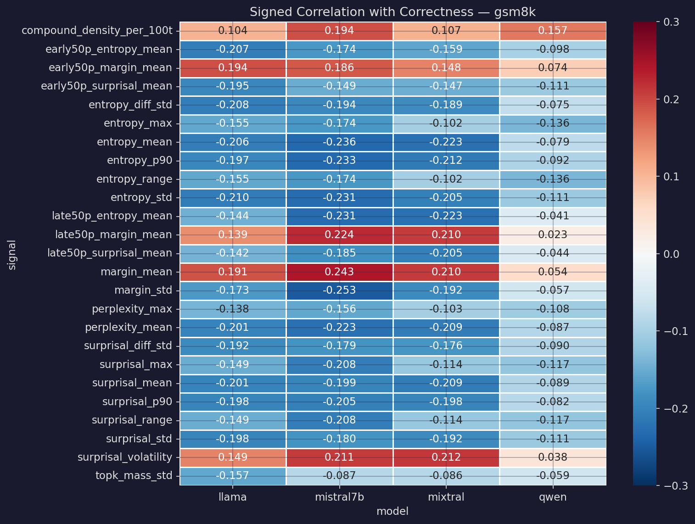

*Figure: Correlation heatmap — GSM8K. Per (model, signal): Spearman correlation with correct; direction and magnitude indicate association strength.*

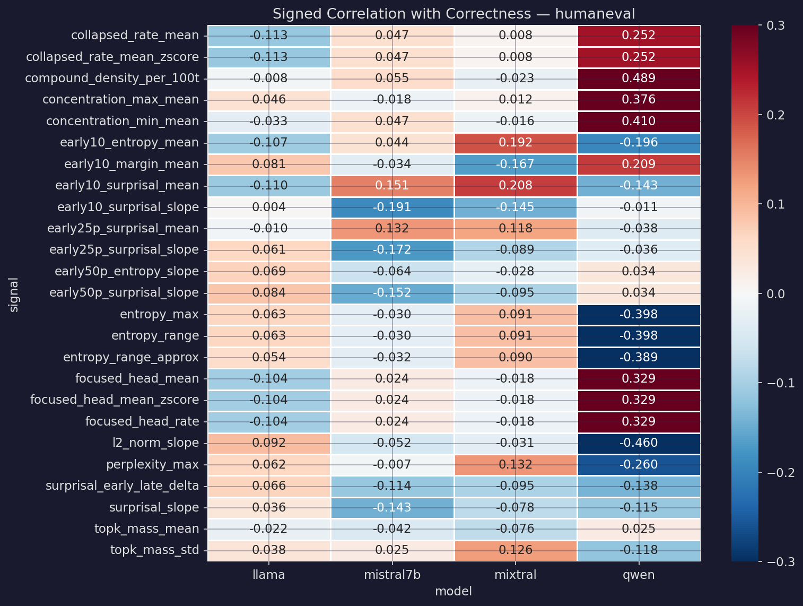

*Figure: Correlation heatmap — HumanEval. Per (model, signal): Spearman correlation with correct.*

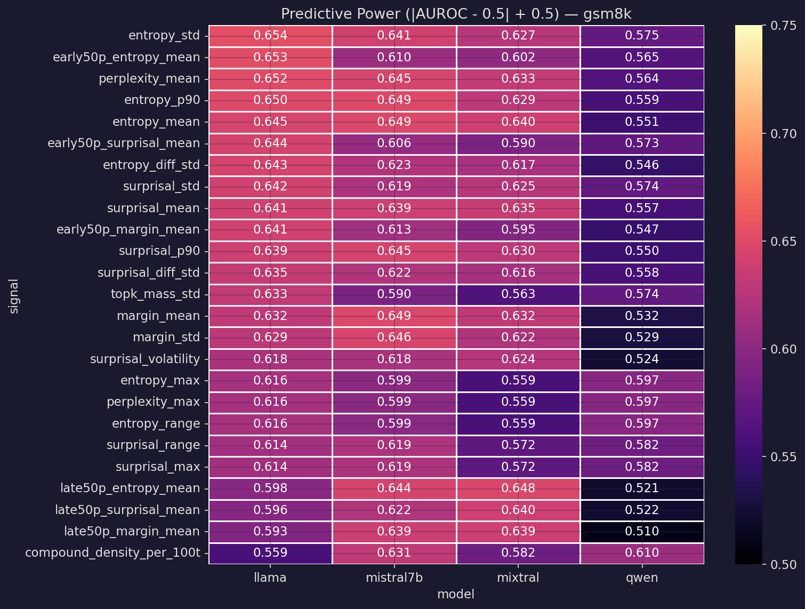

*Figure: Predictive power — GSM8K. Distribution of effective AUROC across signals and models.*

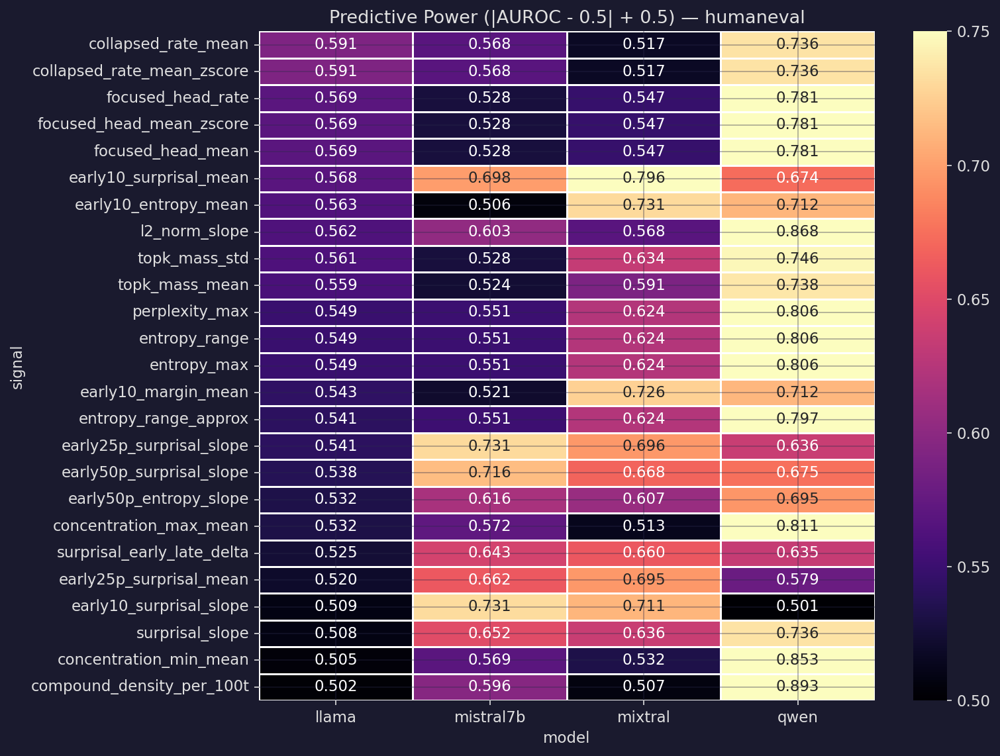

*Figure: Predictive power — HumanEval. Distribution of effective AUROC across signals and models.*

### MoE vs Dense (Focus 2)

This subsection compares the **Mixtral-8x7B** (MoE) architecture to the three dense models (Llama, Mistral-7B, Qwen) on the same CoreVital signals. Sources: `experiment/analysis/focus_02_moe_vs_dense/summary.json` and `experiment/analysis/key_findings.json` (focus_02_moe_vs_dense).

**Counts.** The analysis had **30** signal comparisons (MoE vs dense, per dataset); **29** were significant at *p* &lt; 0.05.

**Effect-size examples.** The largest effects in the current run are:

- **collapsed_rate_mean:** Mixtral differs strongly from dense on both datasets (rank-biserial ≈ −0.90 on GSM8K and HumanEval; higher collapsed rate in MoE).
- **risk_score:** Mean difference (MoE − dense) ≈ 0.51 on GSM8K and ≈ 0.37 on HumanEval (rank-biserial ≈ −0.87 and −0.65); MoE shows higher risk_score on average.
- **l2_norm_cross_layer_max_zscore:** On HumanEval, large negative delta (≈ −0.66), with rank-biserial ≈ 0.35.

So MoE exhibits systematically different internal-signal distributions (e.g. expert-collapse and risk-score levels) versus dense models, which supports using architecture-specific calibration and interpretation.

The following figures show per-signal boxplots and layer-wise entropy comparisons for GSM8K and HumanEval.

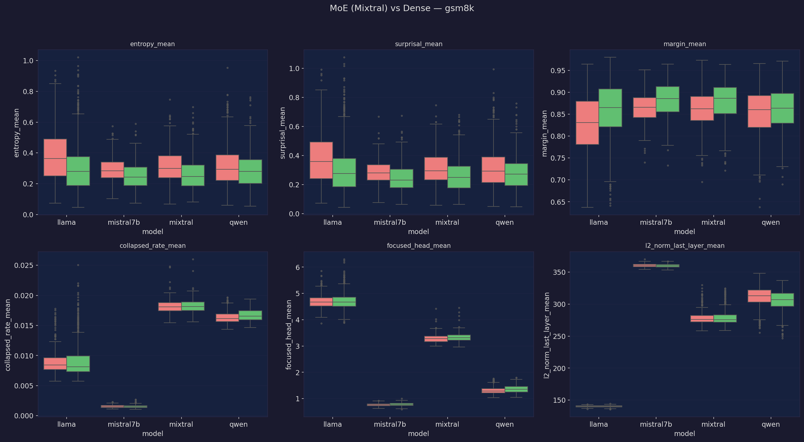

*Figure: MoE vs Dense — GSM8K. Distribution of selected signals by model type (Mixtral vs dense) and correctness.*

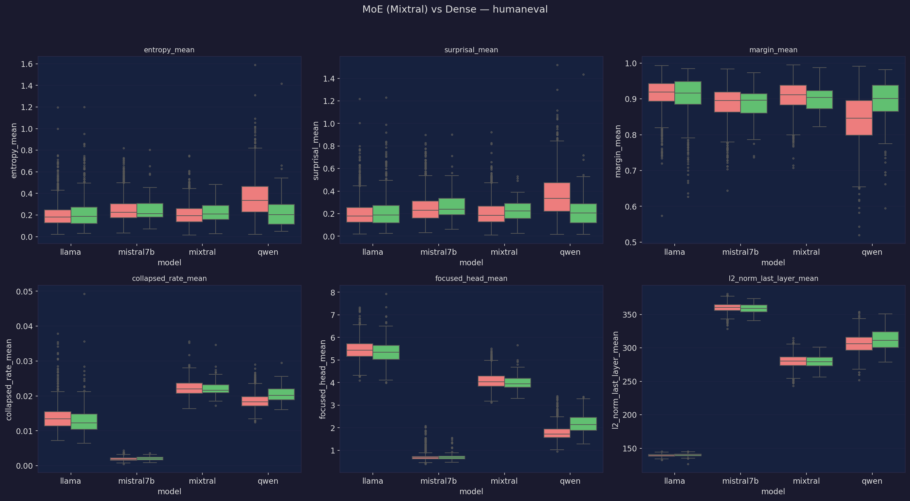

*Figure: MoE vs Dense — HumanEval. Distribution of selected signals by model type and correctness.*

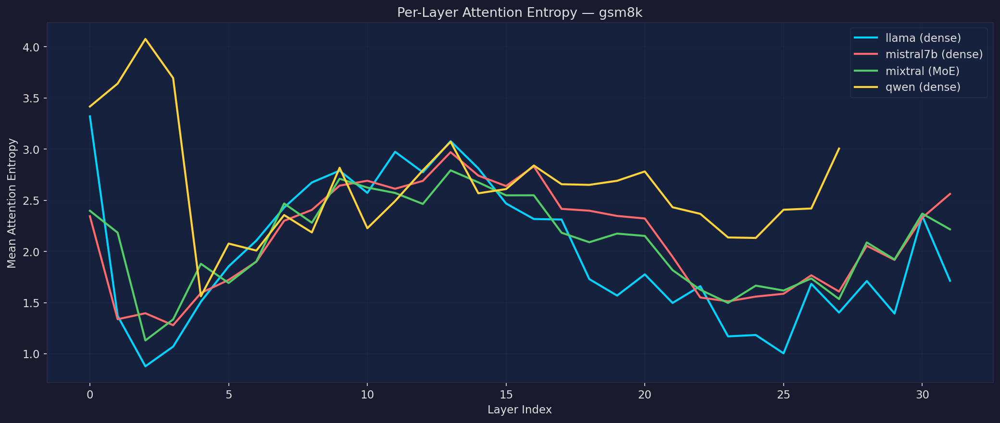

*Figure: Layer entropy — GSM8K. Per-layer attention entropy by model (Mixtral vs dense).*

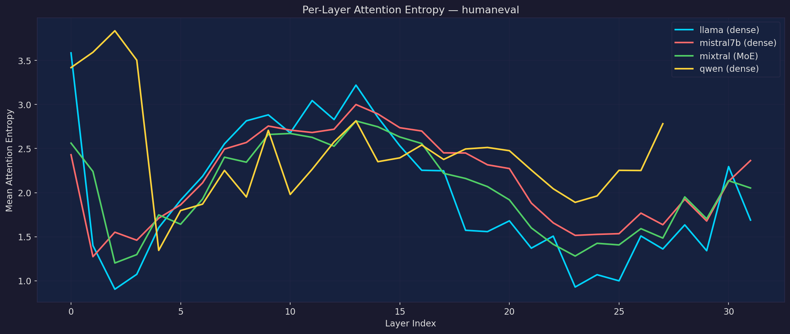

*Figure: Layer entropy — HumanEval. Per-layer attention entropy by model (Mixtral vs dense).*

---

### Self-consistency (Focus 3)

This subsection examines **within-prompt divergence** of run-varying internal signals: for each prompt we compare the same signal across the k runs (e.g. different temperatures/seeds). High divergence indicates that the signal is sensitive to sampling and may help explain consistency or inconsistency of outcomes. Sources: `experiment/analysis/focus_03_self_consistency/summary.json` and `experiment/analysis/key_findings.json` (focus_03_self_consistency).

**Scale.** The analysis used **58,223** divergence pairs and **120,075** dispersion records; temperature sensitivity is available.

**Top divergent signals.** The signals that vary most across runs within a prompt (by mean absolute delta) include:

- **l2_norm_cross_layer_max:** Strong divergence for Mixtral (HumanEval mean delta ≈ −10.4; GSM8K ≈ 5.0) and Qwen (HumanEval ≈ −4.2; GSM8K ≈ 2.7).
- **hidden_max_abs_last_layer_mean:** Qwen/HumanEval (mean delta ≈ −8.5).
- **perplexity_max:** Mixtral/HumanEval (≈ −4.1), Qwen/HumanEval (≈ 2.3), Llama/GSM8K (≈ 1.9).
- **l2_norm_last_layer_mean:** Qwen on both datasets (GSM8K ≈ 2.8, HumanEval ≈ −2.5).

So **run-varying internal signals** (hidden-state norms, perplexity, layer-wise stats) show substantial within-prompt dispersion; this supports using them for self-consistency or best-of-k selection rather than treating a single run’s value as fixed per prompt.

The following figures show entropy-mean and margin-mean divergence distributions by dataset.

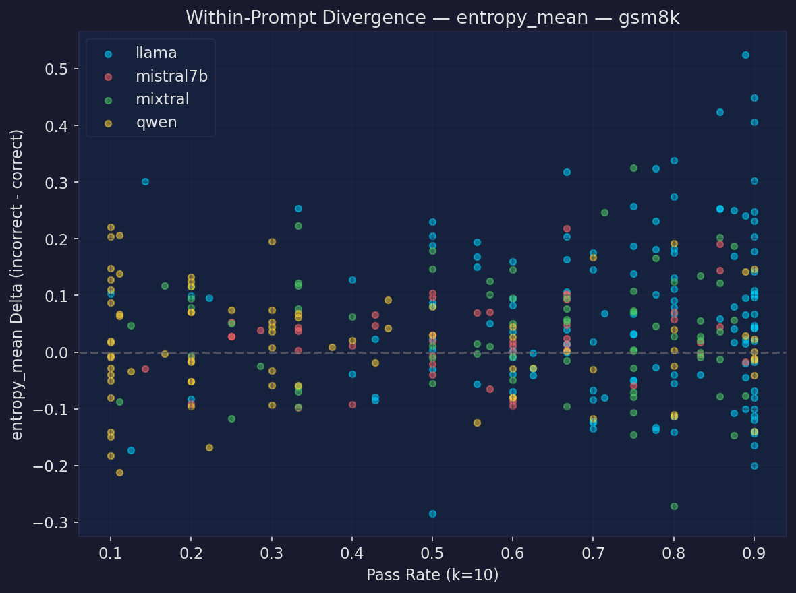

*Figure: Entropy-mean divergence — GSM8K. Distribution of within-prompt divergence in entropy_mean across runs.*

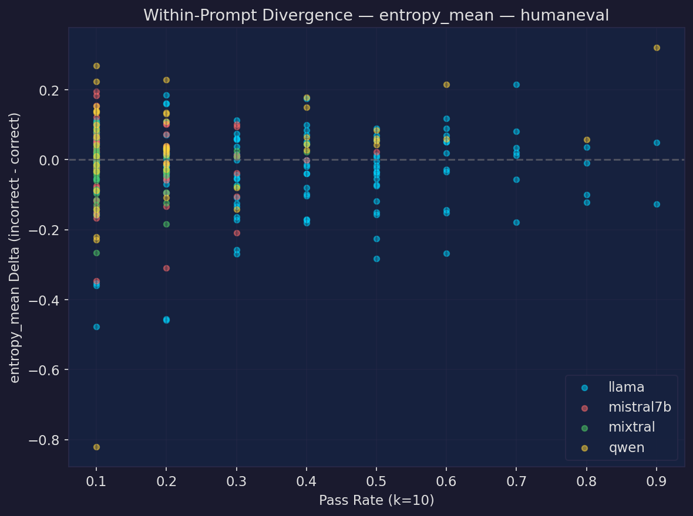

*Figure: Entropy-mean divergence — HumanEval. Distribution of within-prompt divergence in entropy_mean.*

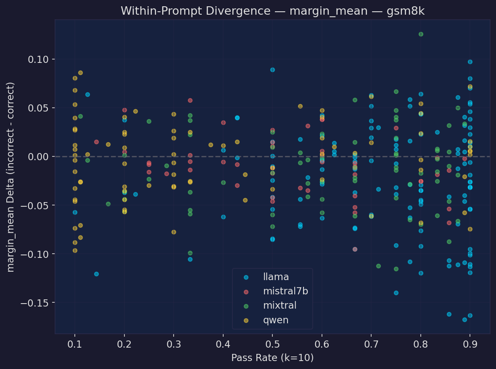

*Figure: Margin-mean divergence — GSM8K. Distribution of within-prompt divergence in margin_mean.*

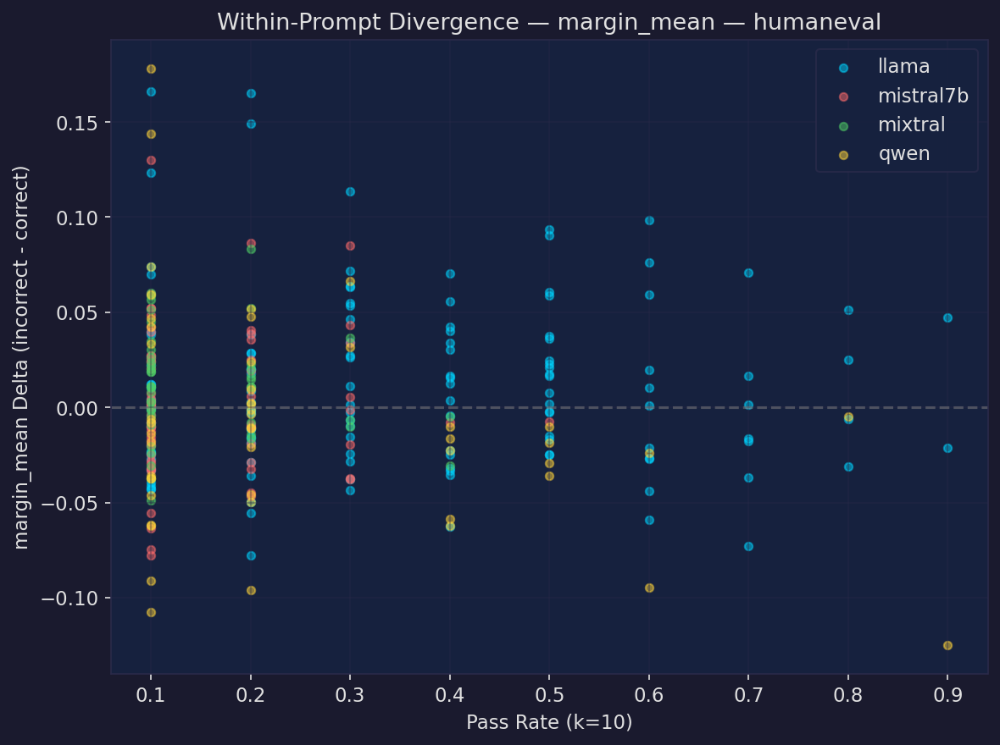

*Figure: Margin-mean divergence — HumanEval. Distribution of within-prompt divergence in margin_mean.*

---

### Layer analysis (Focus 4)

This subsection summarizes **per-layer** association of two metrics (attention entropy and L2 norm of hidden states) with correctness. For each (model, dataset, metric) we get a correlation profile across layers and identify peak layers. Sources: `experiment/analysis/focus_04_layer_analysis/summary.json` and `experiment/analysis/key_findings.json` (focus_04_layer_analysis).

**Scale.** There are **496** layer-level tests across models, datasets, and metrics.

**Peak layers (examples from current run).** Peak correlation and layer index vary by model and task:

| Model     | Dataset   | Metric       | Peak layer | Peak correlation | Note |
|-----------|-----------|--------------|------------|------------------|------|
| llama     | gsm8k     | attn_entropy | 3          | −0.124           | Early layer |
| llama     | gsm8k     | l2_norm     | 12         | 0.160            | Mid |
| llama     | humaneval | attn_entropy| 29         | 0.167            | Late |
| mistral7b | gsm8k     | attn_entropy | 27        | −0.276           | Late |
| mistral7b | gsm8k     | l2_norm     | 18         | 0.249            | Mid |
| mixtral   | gsm8k     | attn_entropy | 23        | −0.228           | Late |
| qwen      | gsm8k     | attn_entropy | 9          | −0.256           | Mid |
| qwen      | gsm8k     | l2_norm     | 18         | 0.243            | Mid |
| qwen      | humaneval | attn_entropy| 2          | −0.484           | Very early |
| qwen      | humaneval | l2_norm     | 10         | 0.477            | Mid |

So **which layer best predicts correctness is model- and dataset-dependent**: early layers matter for Qwen/HumanEval; late layers for Llama/HumanEval and Mistral/Mixtral on GSM8K.

Below we embed **six representative figures** (two per figure family: attention-entropy profile, L2-norm profile, combined layers view). The full set of 24 layer-analysis figures is in `experiment/analysis/focus_04_layer_analysis/figures/`; see also `experiment/analysis/global_manifest.json` for the full gallery.

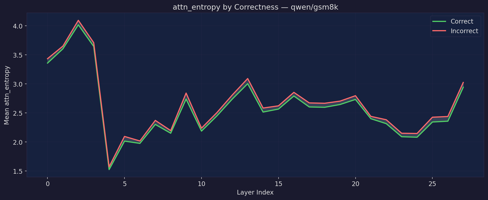

*Figure: Attention entropy profile — Qwen, GSM8K. Per-layer correlation with correctness; peak at layer 9.*

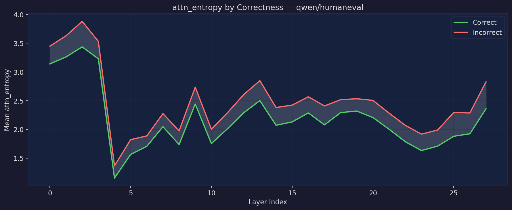

*Figure: Attention entropy profile — Qwen, HumanEval. Per-layer correlation; peak at layer 2.*

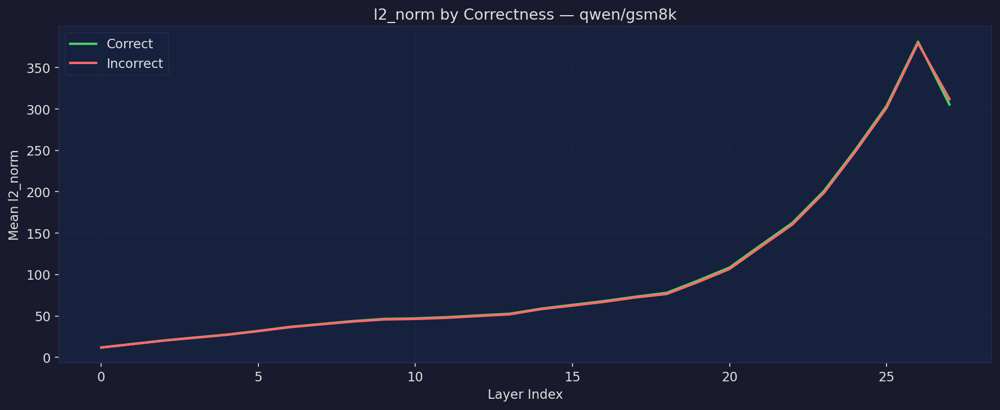

*Figure: L2 norm profile — Qwen, GSM8K. Per-layer correlation with correctness; peak at layer 18.*

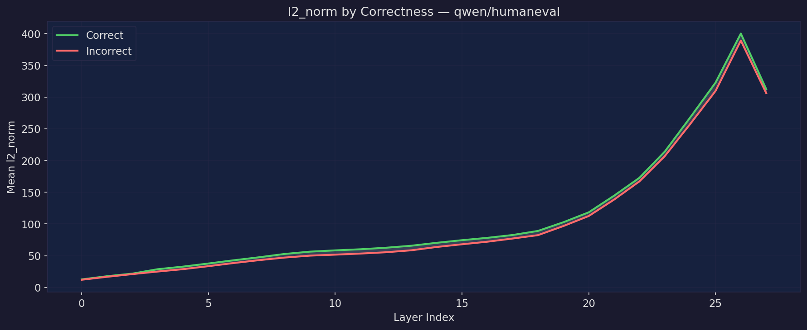

*Figure: L2 norm profile — Qwen, HumanEval. Per-layer correlation; peak at layer 10.*

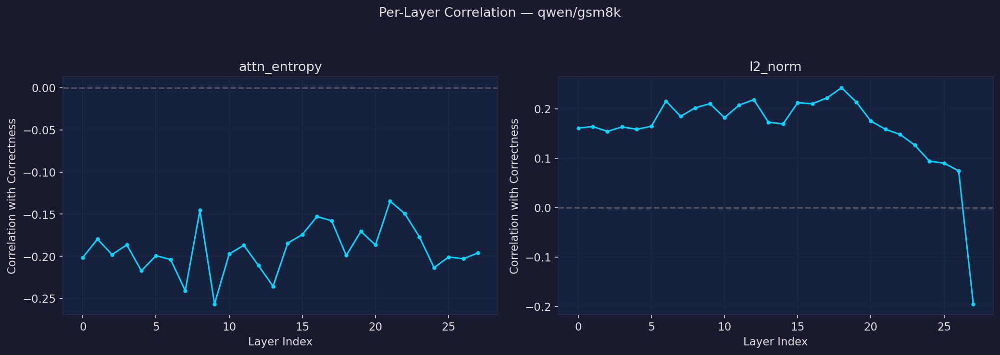

*Figure: Layer analysis overview — Qwen, GSM8K. Combined view of per-layer associations.*

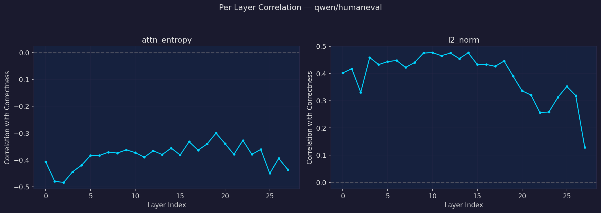

*Figure: Layer analysis overview — Qwen, HumanEval. Combined view of per-layer associations.*

For all 24 Focus 4 figures (attn_entropy_profile, l2_norm_profile, and focus4_layers for each model × dataset), see `experiment/analysis/focus_04_layer_analysis/figures/` and `experiment/analysis/global_manifest.json`.

---

### Difficulty profiling (Focus 5)

This subsection examines **prompt-level** correlation of CoreVital signals with **empirical difficulty**, defined as 1 − mean(correct) pooled across all models and temperatures. Sources: `experiment/analysis/focus_05_difficulty/summary.json` and `experiment/analysis/key_findings.json` (focus_05_difficulty).

**Scale.** The analysis produced **88** per-model correlations and **22** pooled correlations, with **0** invariance issues.

**Top correlations (from current run).** The strongest prompt-level associations with difficulty in this run are:

| Model     | Dataset   | Signal                | Spearman ρ | n_prompts |
|-----------|-----------|------------------------|------------|-----------|
| mistral7b | gsm8k     | layer_transform_std   | −0.263     | 200       |
| llama     | humaneval | prompt_surprisal_max  | 0.242      | 164       |
| qwen      | humaneval | prompt_surprisal_std  | 0.214      | 164       |
| qwen      | humaneval | prompt_surprisal_max  | 0.209      | 164       |
| llama     | humaneval | layer_transform_std   | 0.206      | 164       |

So prompt-level surprisal and layer-transform statistics correlate with which prompts are harder across runs; the strength and direction are model- and dataset-dependent.

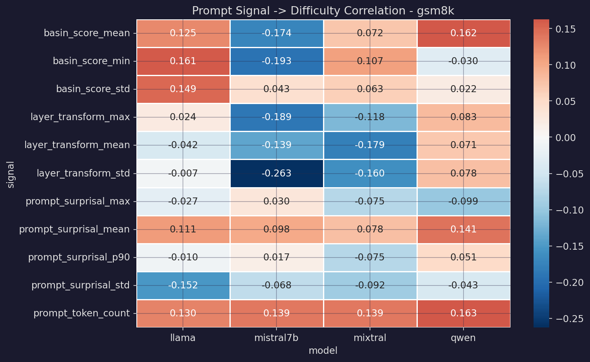

*Figure: Difficulty profiling — GSM8K. Prompt-level signal correlation with empirical difficulty (1 − mean correct).*

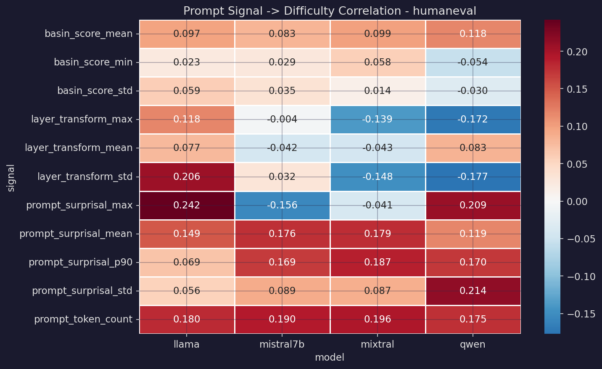

*Figure: Difficulty profiling — HumanEval. Prompt-level signal correlation with empirical difficulty.*

---

### Cross-model alignment (Focus 6)

This subsection summarizes **cross-model difficulty agreement** (do models find the same prompts hard?) and **signal alignment** (do the same internal signals rank prompts similarly across models?). It also notes that **risk is not transferable** and the **fingerprint** is derived summary stats. Sources: `experiment/analysis/focus_06_cross_model/summary.json` and `experiment/analysis/key_findings.json` (focus_06_cross_model).

**Difficulty agreement.** Pairwise Spearman correlation of per-prompt correctness across models varies by dataset and pair. On **GSM8K**: Llama–Mistral ρ ≈ 0.45, Llama–Mixtral ρ ≈ 0.33, Mistral–Mixtral ρ ≈ 0.46; Llama–Qwen and Mistral–Qwen are weak (≈ 0.10 and 0.03); Mixtral–Qwen is slightly negative (−0.13). On **HumanEval**: agreement is moderate (e.g. Llama–Mistral ρ ≈ 0.36, Llama–Qwen ρ ≈ 0.32, Mistral–Mixtral ρ ≈ 0.31); no pair is strongly negative.

**Signal alignment.** For **entropy_mean**, **surprisal_mean**, and **margin_mean**, prompt-level rankings align reasonably across model pairs on GSM8K (e.g. Mistral–Mixtral ρ ≈ 0.54 for entropy_mean and margin_mean). On HumanEval, alignment is weaker. **risk_score** shows very low or negative alignment across model pairs (e.g. Llama–Qwen −0.08, Mistral–Qwen −0.16 on GSM8K), so the built-in risk score does **not** transfer as a consistent difficulty ranking across models.

**Fingerprint note.** From the summary: the 25-d fingerprint is concatenated summary statistics (e.g. fp_00 = entropy_mean, fp_01 = entropy_std), not a learned embedding; fingerprint analysis is redundant with named-feature analysis and should not be treated as independent evidence.

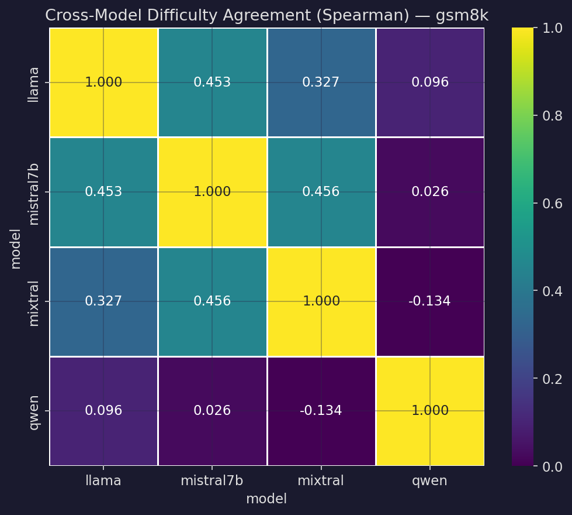

*Figure: Cross-model agreement — GSM8K. Pairwise agreement in per-prompt difficulty.*

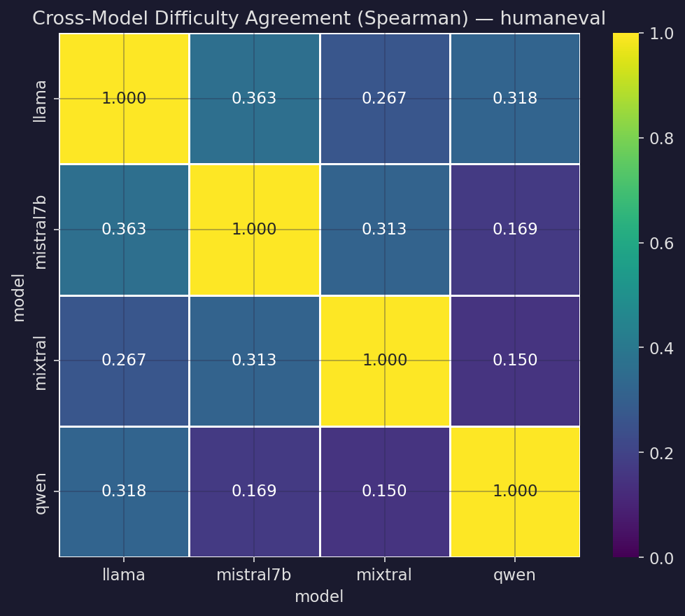

*Figure: Cross-model agreement — HumanEval. Pairwise agreement in per-prompt difficulty.*

---

### Signal ablation

Incremental **tiered ablation** (T1–T6) measures how much discriminative power each feature group adds under **grouped 5-fold CV** by `question_id`. Tiers: T1 entropy_only (1 feature), T2 confidence_baseline (3), T3 + prompt_signals (12), T4 + early_window (30), T5 + health_signals (44), T6 full_corevital (104). Metric: AUROC. Sources: `experiment/analysis/ablation/summary.json`, `experiment/analysis/ablation/tables/ablation_ablation_summary.csv`, and Part 0 verification.

**T6 AUROC range (full_corevital, 104 features):** 0.60-0.90 across 8 model/dataset cells.
- **Best:** Qwen/HumanEval (0.90)
- **Worst:** Qwen/GSM8K (0.60)
- **Full results:** Llama gsm8k 0.635, humaneval 0.613; Mistral-7B gsm8k 0.670, humaneval 0.766; Mixtral gsm8k 0.650, humaneval 0.820

**Key nuance: where the information lives.** Do **not** assume T6 is always the best tier or that gains are uniform. The biggest jumps vary by model/task:

- **Qwen/HumanEval:** Huge jump at **T4** (early-window features): 0.73 → 0.85 (+0.12). T6 adds another +0.05 to reach 0.90.
  - **Implication:** Early-window features (first 10-25% of generation) drive HumanEval discrimination.
- **Mistral/GSM8K:** Peak at **T5** (0.71); **T6 drops to 0.67** — adding all features hurts (overfitting or noise).
  - **Implication:** Health signals (T5) matter; full feature set doesn't help.
- **Llama/GSM8K:** T3 (0.56) < T4 (0.62) < T6 (0.64); main jump is T3→T4.
  - **Implication:** Prompt signals (T3) help less than early-window (T4) for GSM8K.

**Where information lives:**
- **HumanEval (code):** Early-window features (T4) provide the biggest gain. Models show internal "confusion" or "clarity" early in code generation.
- **GSM8K (math):** Mixed. Some models benefit from prompt signals (T3), others from early-window (T4) or health signals (T5).
- **Full feature set (T6):** Best in 6/8 cells, but not universal. Can hurt when features are redundant or noisy.

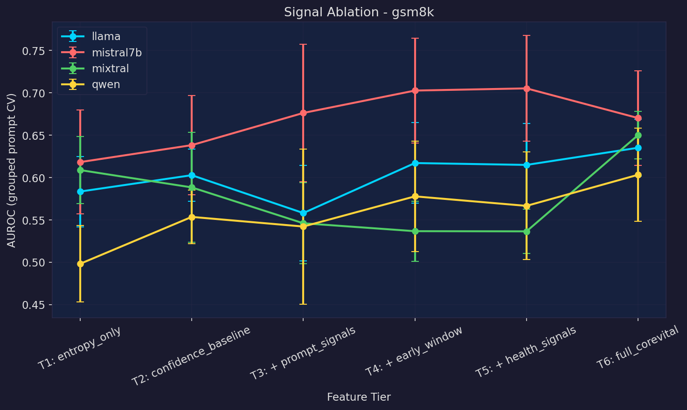

*Figure: Signal ablation — GSM8K. Mean AUROC by tier (T1–T6) per model.*

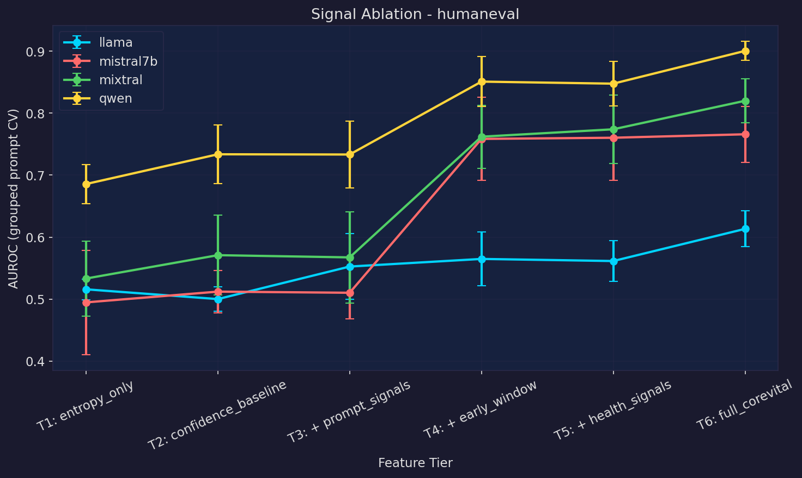

*Figure: Signal ablation — HumanEval. Mean AUROC by tier (T1–T6) per model.*

---

### Ranking (best-of-k)

For prompts with at least one correct run, we rank the k runs by a run-varying CoreVital signal and measure **accuracy when selecting the top-ranked run** vs random choice vs oracle. Sources: `experiment/analysis/ranking/summary.json` and `experiment/analysis/key_findings.json` (ranking).

**Scale.** **647** (model, dataset, signal) ranking results.

**Top lift vs random (from current summary).** Examples:

- **mixtral/humaneval, early10_surprisal_mean:** random_acc ≈ 15.2%, signal_acc 50.0%, lift_vs_random ≈ **+34.8** pp (n_prompts 44).
- **mistral7b/humaneval, early10_surprisal_slope:** random_acc ≈ 16.0%, signal_acc ≈ 47.7%, lift_vs_random ≈ **+31.7** pp (n_prompts 65).
- **qwen/humaneval, entropy_slope:** random_acc ≈ 31.2%, signal_acc ≈ 55.8%, lift_vs_random ≈ **+24.6** pp (n_prompts 52).
- **qwen/humaneval, compound_density_per_100t:** random_acc ≈ 31.2%, signal_acc ≈ 54.8%, lift_vs_random ≈ **+23.7** pp (n_prompts 52).

So run-varying signals can substantially improve best-of-k selection over random, especially where baseline accuracy is low (e.g. Mixtral/Mistral on HumanEval).

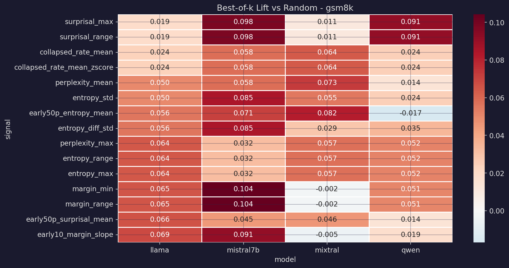

*Figure: Ranking — GSM8K. Lift in accuracy when selecting by signal vs random.*

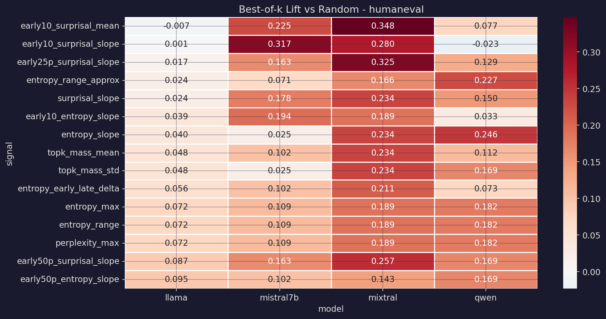

*Figure: Ranking — HumanEval. Lift in accuracy when selecting by signal vs random.*

---

### Confidence calibration

**Confidence calibration** tests whether model confidence (margin_mean) predicts accuracy, and identifies CoreVital signals that catch confident-but-wrong runs. Sources: `experiment/analysis/confidence_calibration/summary.json`.

**Finding:** Models are **catastrophically overconfident**—they assign high confidence (margin) to many incorrect outputs. However, **CoreVital signals still discriminate** within the confident subset.

**Top signals catching confident-but-wrong (from current summary):**

- **Qwen/HumanEval:**
  - `compound_density_per_100t`: AUROC 0.92 on confident runs (mean: correct 2.50 vs wrong 0.44)
  - `l2_norm_slope`: AUROC 0.88 (mean: correct -1.31 vs wrong -0.25)
  - `entropy_range`, `entropy_max`: AUROC 0.87 (higher entropy range in confident-wrong)

- **Mistral/GSM8K** (examples from detailed tables):
  - `hidden_max_abs_last_layer_mean`: AUROC ~0.90 on confident runs
  - Hidden-state magnitude signals distinguish confident-correct from confident-wrong

**Implication:** Standard confidence calibration (using model's own confidence scores) is broken. But **CoreVital's internal signals contain orthogonal information** that catches failures even when the model is confident.

**Figures:** See `experiment/analysis/confidence_calibration/figures/` for calibration curves and confident-wrong signal distributions.

---

### Outcome profiling (three-way signatures)

**Outcome profiling** tests whether correct, incorrect, and format-failure runs have distinct signal signatures, or whether failure is a single spectrum. Sources: `experiment/analysis/outcome_profiling/summary.json`.

**Counts (current run):**
- **Incorrect:** 7,980
- **Correct:** 3,423
- **Format failure:** 3,137

**Finding:** The three outcomes have **distinct, architecture-dependent signatures**. Signals with high **specificity gap** (strong for one outcome, weak for others) indicate distinct failure modes.

**Top specific signals (from current summary):**

| Model     | Outcome        | Signal                              | Predictive Power | Specificity Gap |
|-----------|----------------|-------------------------------------|------------------|-----------------|
| Mistral   | Incorrect      | `hidden_max_abs_last_layer_mean`    | 0.90             | 0.17            |
| Mistral   | Incorrect      | `l2_norm_cross_layer_max`           | 0.87             | 0.15            |
| Mixtral   | Incorrect      | `focused_head_mean`                 | 0.90             | 0.14            |
| Qwen      | Format failure | `concentration_min_mean`            | 0.77             | 0.23            |
| Qwen      | Format failure | `concentration_max_mean`            | 0.76             | 0.21            |
| Llama     | Format failure | `early10_entropy_mean`              | 0.68             | 0.11            |

**Architecture patterns:**
- **Dense models (Llama/Qwen):** Format failure predicted by early-window entropy, concentration, focused-head signals
- **MoE (Mixtral):** Incorrect runs show focused-head patterns (expert routing issues?)
- **Mistral:** Incorrect runs show hidden-state magnitude anomalies (last-layer, cross-layer max)

**Implication:** A single "failure detector" is insufficient. **Per-outcome, per-architecture models** are needed.

**Tables:** See `experiment/analysis/outcome_profiling/tables/` for full one-vs-rest and specificity results.

---

### Temperature robustness

**Temperature effects** analysis tests whether CoreVital signal distributions and predictive power change between temperatures (0.7 vs 0.8). Sources: `experiment/analysis/temperature_effects/summary.json`.

**Counts:**
- **n_shift_tests:** 400 (distribution shift tests per signal/model/dataset)
- **n_pp_tests:** 160 (predictive power tests)

**Finding:** **Robust**. CoreVital signals are stable across temperatures.

**Mean absolute predictive power shift:** **0.028** (nearly identical discrimination at temp 0.7 vs 0.8)

**Implication:** Signals measure **model internals**, not just **sampling artifacts**. This validates that CoreVital captures inference health, not temperature-dependent randomness.

**Figures:** See [experiment/analysis/temperature_effects/figures/](../experiment/analysis/temperature_effects/figures/) for predictive-power scatter by dataset (GSM8K, HumanEval).

---

### Difficulty-stratified analysis

**Difficulty-stratified** analysis tests whether CoreVital signals are equally predictive on easy, medium, and hard questions (bands defined by empirical pass rate). Sources: `experiment/analysis/difficulty_stratified/summary.json`.

**Finding:** **Some difficulty sensitivity.** Mean predictive-power range across difficulty bands is **0.106**; signals are not uniformly predictive. For some model/dataset cells, predictive power is **higher on easy questions** than on hard ones. Examples from the current run:

- **Mistral/GSM8K:** `hidden_max_abs_last_layer_mean`, `compound_density_per_100t`, and `collapsed_rate_mean` have PP on easy ≈ 0.86–0.92 vs PP on hard ≈ 0.51–0.56 (range ≈ 0.35).
- **Mixtral/GSM8K:** `compound_density_per_100t` shows similar pattern (PP easy 0.75 vs hard 0.51).

**Implication:** When building detectors, consider stratifying by difficulty or expecting lower discrimination on hard prompts.

---

### Format failure

**Format failure** means the output was ungradable (e.g. GSM8K missing `####`). Only GSM8K has format failures in this experiment. This subsection reports prevalence and top predictive signals; there are **no figures** for this section. Sources: `experiment/analysis/format_failure/summary.json`, Part 0 (total traces **14,540**), and `experiment/analysis/format_failure/tables/` for detailed tables.

**Prevalence.** Out of **14,540** total runs (verified Part 0), **3,137** are format failures. Per (model, dataset):

| Model     | Dataset | n_runs | n_failures | Failure rate |
|-----------|---------|--------|------------|--------------|
| llama     | gsm8k   | 2000   | 359        | 17.9%        |
| mistral7b | gsm8k   | 2000   | 1445       | 72.2%        |
| mixtral   | gsm8k   | 2000   | 1242       | 62.1%        |
| qwen      | gsm8k   | 2000   | 91         | 4.5%         |
| (all)     | humaneval | —    | 0          | 0%           |

Mistral and Mixtral have the highest format-failure rates on GSM8K; Llama and especially Qwen are much lower.

**Top predictive signals.** CoreVital signals predict format failure well for Mistral and Mixtral. From the current summary:

- **mistral7b:** **hidden_max_abs_last_layer_mean** (and _zscore): correlation −0.64, predictive power ≈ 0.88 (lower → more failure); **l2_norm_cross_layer_max** (and _zscore): correlation −0.59, predictive power ≈ 0.85.
- **mixtral:** **focused_head_mean_zscore**: correlation −0.53, predictive power ≈ 0.83 (lower → more failure).

So format failure is predictable from internal-state and attention statistics, especially for Mistral and Mixtral. For full tables (e.g. prevalence, signal association, length comparison), see `experiment/analysis/format_failure/tables/`.

---

## 3. Risk calibration

This section summarizes calibration of CoreVital’s built-in risk-related scores and the **data-driven failure model** (step 5). All numbers come from `experiment/calibration/step1_ece_results.json`, `experiment/calibration/step1_failure_risk_results.json`, `experiment/calibration/step5_proposed_risk_model.json`, and `experiment/calibration/step6_per_model_evaluation.json`. Evaluations use **grouped held-out CV** by `question_id` (and by model/dataset for step 5); analyses use the **11,403** non–format-failure runs (Part 0 verified).

### Built-in risk_score (step 1)

The built-in **risk_score** was evaluated per (model, dataset) with **Platt scaling**: fit on train folds, applied on held-out prompt groups. **Expected Calibration Error (ECE)** drops sharply after calibration in every cell (raw → calibrated), but **AUROC** remains modest—Platt scaling improves probability calibration without turning the raw heuristic into a strong discriminator. Examples from step 1:

- **llama/gsm8k:** ECE raw 0.239 → calibrated 0.003; AUROC raw 0.567 (grouped CV).
- **mistral7b/gsm8k:** ECE raw 0.559 → calibrated 0.0003; AUROC raw 0.494.
- **mixtral/gsm8k:** ECE raw 0.696 → calibrated 0.009; AUROC raw 0.487.
- **qwen/gsm8k:** ECE raw 0.349 → calibrated 0.001; AUROC raw 0.537.
- **qwen/humaneval:** ECE raw 0.479 → calibrated 0.020; AUROC raw 0.616.

So the raw risk score is **poorly calibrated** (high ECE) and only modestly discriminative (AUROC near or below 0.6 in several cells); after Platt scaling, ECE is low but discrimination does not improve.

### Built-in failure_risk (step 1)

The built-in **failure_risk** **was evaluated** in the same grouped held-out protocol (`experiment/calibration/step1_failure_risk_results.json`). It does **not** behave like a reliable calibrated predictor of task failure: AUROC is near chance in many cells (e.g. llama/gsm8k 0.504, mistral7b/gsm8k 0.501, mixtral/gsm8k 0.504), and ECE is high where the score has spread (e.g. qwen/humaneval ECE raw 0.705, llama/humaneval 0.606). In cells where failure_risk is highly saturated (e.g. Mistral/Mixtral), ECE is low but the score carries almost no discriminative information. The report therefore describes failure_risk as **evaluated but weak**—not a production-ready calibrated predictor.

### Data-driven failure model (step 5)

Step 5 fits a **pooled logistic regression** predicting **failure** (not correctness) on the 11,403 runs, with **grouped held-out evaluation** by model, dataset, and `question_id`. After evaluation, coefficients are fit on all labeled data for a deployable formula. Results (from `step5_proposed_risk_model.json`):

- **n_samples:** 11,403  
- **Grouped-CV AUROC:** 0.744  
- **Grouped-CV ECE:** 0.164  
- **Selected features (6):** entropy_mean, margin_mean, topk_mass_mean, prompt_surprisal_mean, basin_score_mean, entropy_slope  

**Formula:** `P(failure) = sigmoid(intercept + Σ coef_i × (feat_i − mean_i) / std_i)`, with intercept and coefficients in `step5_proposed_risk_model.json`. This is a **grouped held-out failure model**, not an in-sample P(correct) model.

Pooled, step 5 improves over the current risk_score baseline (step 5 AUROC 0.744 vs current_risk AUROC 0.592, step 5 ECE 0.164 vs current_risk ECE 0.232 in the same JSON).

### Per-model transfer (step 6)

**Step 6** evaluates the same step-5 model in each (model, dataset) cell. The pooled learned model is **not uniformly better** in every cell. From `step6_per_model_evaluation.json`, **delta_vs_risk_score** (proposed AUROC − risk_score AUROC) is:

- **Negative** (proposed worse than risk_score): llama/gsm8k (−0.007), llama/humaneval (−0.018), mistral7b/gsm8k (−0.077), mixtral/humaneval (−0.051), qwen/humaneval (−0.015).  
- **Positive** (proposed better): mistral7b/humaneval (+0.026), mixtral/gsm8k (+0.055), qwen/gsm8k (+0.027).

So the pooled model is promising overall but **do not** present it as a universal replacement; per-cell results are mixed.

### Calibration figures

The following figures show calibration curves for the built-in risk_score and failure_risk (from `experiment/analysis/risk_calibration/`).

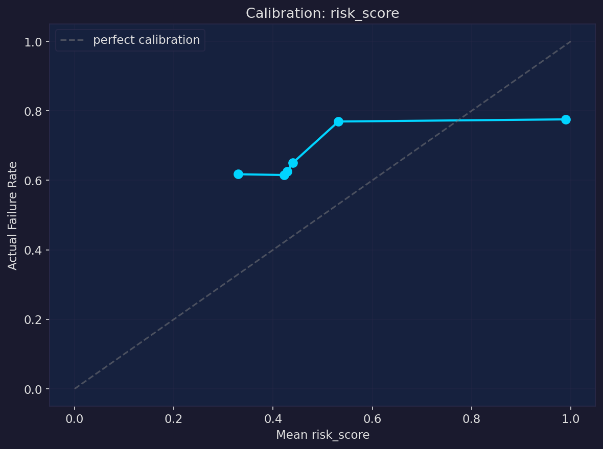

*Figure: Risk score calibration. Predicted probability vs observed failure rate (risk_score, step 1).*

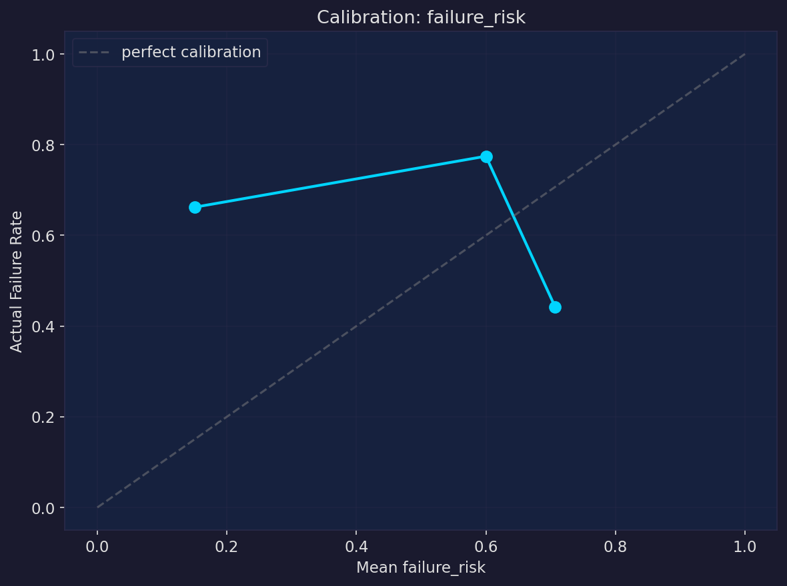

*Figure: Failure risk calibration. Predicted probability vs observed failure rate (failure_risk, step 1).*

---

## 4. Methodology notes

This section documents how the analyses and calibration were performed so the report is reproducible. Implementations are in `experiment/scripts/analyze.py` (ablation, correlation, difficulty, ranking, format failure, risk calibration figures) and `experiment/scripts/calibrate_risk.py` (step 1 ECE/Platt; step 3 per-cell LR; step 4 consensus; step 5 global logistic; step 6 per-model eval). All correctness-conditioned analyses and calibration use the **11,403** non–format-failure runs (Part 0 verified); format-failure analysis uses all **14,540** traces.

### Ablation

Signal ablation uses **tiers T1–T6** (entropy_only → confidence_baseline → + prompt_signals → + early_window → + health_signals → full_corevital). The classifier is **HistGradientBoostingClassifier** (NaN-native; `max_iter=100`, `max_depth=4`, `class_weight="balanced"`). Splits are **grouped 5-fold CV** by `question_id`: **StratifiedGroupKFold** when available, otherwise **GroupKFold**, so prompt-level telemetry is evaluated on unseen prompt groups. The metric is **AUROC**.

### Metric correlation

Per (model, dataset, signal): point-biserial correlation with correctness, raw AUROC, and **direction-aware predictive power** (effective AUROC = max(raw_auc, 1 − raw_auc)). Significance is controlled at **FDR 0.05** (Benjamini–Hochberg). Core analyses use `get_analysis_signals(include_prompt=False, include_performance=False)`, so **prompt-invariant** and **performance-only** features are excluded by default. **Prompt-level difficulty** (Focus 5) uses `prompt_level.parquet` when available; otherwise it aggregates from the run-level table by (model, dataset, question_id).

### Calibration

**ECE (Expected Calibration Error)** and **Platt scaling** are evaluated per (model, dataset): Platt is fit on train folds and applied to held-out prompt groups; ECE is computed on the held-out scores. **Step 5** fits a **logistic regression** on **standardized** features (StandardScaler) predicting **failure** (label = 1 − correct). Evaluation is **grouped held-out CV** by (model, dataset, question_id); after evaluation, a single **pooled global model** is fit on all 11,403 rows to obtain deployable coefficients and intercept. The formula is `P(failure) = sigmoid(intercept + Σ coef_i × (feat_i − mean_i) / std_i)`. Step 3 derives per-cell weights; step 4 builds feature consensus; step 6 evaluates the step-5 model in each (model, dataset) cell.

### Signal redundancy

Signal-redundancy analysis clusters the 95 analysis signals by correlation (|r| > 0.80), yielding **47 families**. A **recommended minimal set** of 20 representative signals (one per family or key representative) retains most predictive power; see `experiment/analysis/signal_redundancy/summary.json` and `tables/redundancy_family_summary.csv`. This supports feature selection when building lean detectors.

### Ranking

Best-of-k ranking uses **run-varying signals** only (prompt-invariant signals are excluded). For each (model, dataset, signal), the script infers **direction** from AUROC (higher vs lower better). When selecting the “best” run per prompt, **ties** (multiple runs with the same extremal signal value) are handled by **expected correctness**—i.e. the mean of `correct` over those runs—rather than arbitrary tie-breaking.

---

## 5. Limitations

This validation is based on a **single run**: one execution of the experiment pipeline (14,540 total traces; 11,403 non–format-failure runs used for correctness and calibration). No repeated runs or confidence intervals are reported for aggregate metrics.

**Scope.** Only **two benchmarks** (GSM8K, HumanEval) and **four models** (Llama-3.1-8B, Qwen-2.5-7B, Mistral-7B, Mixtral-8x7B) were evaluated. Generalization to other tasks, domains, or model families is unknown.

**Format failure.** The **format_failure** label (e.g. GSM8K missing `####`) applies only to GSM8K in this setup; HumanEval had no format failures. Conclusions about format-failure predictability are limited to GSM8K and the models tested.

**Risk score transfer.** The built-in **risk_score** does **not** transfer cleanly across models: cross-model alignment for risk_score is very low or negative (e.g. Llama–Qwen −0.08, Mistral–Qwen −0.16 on GSM8K). A risk score that ranks prompts well for one model may not rank them for another.

**Pooled learned model.** The data-driven failure model (step 5) achieves grouped-CV AUROC ~0.744 and ECE ~0.164 on the 11,403 runs, but **step 6** shows the pooled model does **not** uniformly outperform the heuristic risk_score in every (model, dataset) cell. In several cells (e.g. llama/gsm8k, llama/humaneval, mistral7b/gsm8k, mixtral/humaneval, qwen/humaneval) the proposed model has lower AUROC than the built-in risk_score. Do not treat the step-5 formula as a universal replacement.

**Entropy-only and tier variability.** Entropy-only (T1) and other narrow feature sets are weak in some cells; which tier gives the main lift varies (e.g. T4 often provides the main jump; T6 is not always best—e.g. mistral7b/gsm8k, where T5/T4 AUROC exceed T6).

**Fingerprint.** The 25-dimensional fingerprint is **derived summary statistics** (e.g. fp_00 = entropy_mean, fp_01 = entropy_std), not a learned embedding. Fingerprint analysis is redundant with named-feature analysis and should not be cited as independent evidence.

**Prompt-count anomaly.** mixtral/gsm8k has 201 prompts (vs nominal 200). Part 0 source (grades.jsonl) gives 2,000 total runs; some artifacts report 2,001 runs—unresolved discrepancy. Documented in the main results table and Part 0 verification log rather than normalized away.

### Risk score and early warning

The built-in **risk_score** is a **heuristic, research-grounded placeholder**. It was never intended to be production-calibrated out of the box. The validation experiment showed that raw risk has **poor calibration** (high ECE before Platt scaling) and only **modest pooled discrimination** as-is, while the **data-driven grouped held-out failure model** (step 5) improves pooled AUROC and ECE. For production use, apply explicit calibration or a learned model and treat the heuristic score as indicative only.

The built-in **failure_risk** **was evaluated** in the experiment and did **not** behave like a reliable calibrated predictor of task failure. The trend detectors (entropy accelerating, margin declining, etc.) remain **theoretical / exploratory**. Use these signals for debugging and research iteration, not as production quality predictors.

---

## 6. Next steps

Based on validation findings:

1. **Implement per-model calibration** — Step 6 showed the pooled model (step 5) underperforms on most individual cells. Fit separate models per (model, dataset) or per architecture.
2. **Add confident-but-wrong detector** — Use signals from confidence calibration analysis (compound_density, l2_norm_slope, entropy_range) to catch overconfident failures.
3. **Add per-outcome models** — Three-way outcome profiling shows distinct signatures. Build separate predictors for format-failure vs task-incorrectness.
4. **Leverage early-window features** — Qwen/HumanEval shows huge gains at T4 (early-window). Implement partial-generation risk estimation for offline analysis.
5. **Run on more benchmarks** and model families to test generalization beyond GSM8K/HumanEval.
6. **Document calibration usage** in `docs/risk-calibration.md`: how to run `calibrate_risk.py`, interpret step 1–6 outputs, and use per-model calibration.
7. **Replace built-in risk score** with learned model (but only after per-model calibration; pooled step-5 model is not a universal replacement).
8. **Clean up or explain** the prompt-count discrepancy (mixtral/gsm8k 201 prompts; runs 2,000 per grades.jsonl vs 2,001 in some artifacts).

---

## 7. Data references

All paths are relative to the repository root. These artifacts are the single source of truth for the numbers in this report.

**Ground truth and features**

- **Grades (per-run labels):** `experiment/results/grades.jsonl` — one JSON object per run: model, dataset, prompt_id, run_id, correct, format_failure, etc. Total traces in this run: **14,540** (verified Part 0).
- **Features table:** `experiment/results/features.parquet` — extracted CoreVital signals per run; used by both analysis and calibration. Correctness-based analyses use rows with format_failure excluded (**11,403** rows; verified Part 0).
- **Extraction summary:** `experiment/results/extraction_summary.md` — traces scanned, rows extracted, and per-model/dataset counts.

**Calibration outputs**

- **Step 1 (ECE and Platt):** `experiment/calibration/step1_ece_results.json` — per-cell ECE raw, ECE calibrated, n_samples, failure_rate.
- **Step 1 (failure_risk):** `experiment/calibration/step1_failure_risk_results.json` — evaluation of the built-in failure_risk heuristic per cell.
- **Step 5 (proposed failure model):** `experiment/calibration/step5_proposed_risk_model.json` — target=failure, n_samples=11,403, grouped-CV AUROC ≈ 0.744, ECE ≈ 0.164, selected features and coefficients.
- **Step 6 (per-model evaluation):** `experiment/calibration/step6_per_model_evaluation.json` — per-cell comparison of step-5 model vs risk_score.

**Analysis outputs**

- **Key findings:** `experiment/analysis/key_findings.json` — curated findings by section.
- **Results summary:** `experiment/analysis/RESULTS_SUMMARY.md` — accuracy table and design summary.
- **Global figure manifest:** `experiment/analysis/global_manifest.json` — full list of figures and section structure; use this to locate all analysis figures.
- **Section data:** For each analysis section (e.g. focus_01_metric_correlation, ablation, format_failure, risk_calibration), summaries and tables live under `experiment/analysis/<section>/summary.json` and `experiment/analysis/<section>/tables/*.csv`; figures under `experiment/analysis/<section>/figures/*.png`.

---

## 8. Glossary

- **Pass@k** — For each prompt we generate k runs (here k=10: 5 at temp 0.7, 5 at temp 0.8); a prompt “passes” if at least one run is correct. Metrics in this report use run-level correctness, not only pass/fail per prompt.
- **ECE (Expected Calibration Error)** — Measure of how well predicted probabilities match empirical outcome frequencies; lower is better. Computed over bins; we report ECE under grouped held-out evaluation.
- **Platt scaling** — Post-hoc calibration that fits a sigmoid on (e.g. risk_score) to map scores to probabilities; fit on training folds and evaluated on held-out prompt groups.
- **Predictive power** — In this report, direction-aware effective AUROC: the extent to which a signal discriminates correct vs incorrect runs, with direction (higher vs lower signal = correct) taken from the data.
- **format_failure** — Label indicating the run’s output was ungradable (e.g. GSM8K: no `####`-preceded answer). Only GSM8K has format_failure in this experiment; such runs are excluded from correctness/calibration analyses (11,403 rows used).
- **correct** — Label indicating task success: for GSM8K, extracted answer matches gold; for HumanEval, sandboxed tests pass. Defined only for runs that are not format_failure.
- **risk_score** — Built-in CoreVital heuristic (0–1) from internal signals; not production-calibrated; evaluated in step 1 (ECE/Platt) and step 6.
- **failure_risk** — Built-in CoreVital early-warning-style score; evaluated in step 1 and did not behave as a reliable calibrated predictor of task failure in this experiment.
- **Grouped held-out evaluation** — Train/test splits are by prompt (question_id) so that all runs from the same prompt stay in the same fold; avoids leakage and reflects deployment where new prompts are unseen.

---

## 9. Reproducibility

**Pipeline order.** From the repo root, run:

1. **Generate and grade:** `python experiment/scripts/run_experiment.py` — produces `experiment/results/grades.jsonl` (and raw outputs as configured). Uses k=10 per prompt, two temperatures, four models, GSM8K and HumanEval.
2. **Extract features:** `python experiment/scripts/extract_features.py` — reads grades and CoreVital traces, writes `experiment/results/features.parquet` and `experiment/results/extraction_summary.md`.
3. **Analyze:** `python experiment/scripts/analyze.py` — consumes `features.parquet`; writes section summaries, tables, and figures under `experiment/analysis/<section>/`.
4. **Calibrate:** `python experiment/scripts/calibrate_risk.py` — consumes `features.parquet`; writes step 1–6 JSONs under `experiment/calibration/`.

Analysis and calibration can be run in parallel after extraction; both use the same feature table and the same exclusion rule (format_failure excluded for correctness/calibration; **11,403** runs for step 5).

**Environment.** Python 3 with dependencies as in the project’s environment (e.g. `requirements.txt` or project-specific lockfile). Feature extraction and model runs require GPU for inference; analysis and calibration scripts run on CPU (pandas, scikit-learn, etc.). Exact versions and hardware for this run are documented in `experiment/metadata/` (e.g. `system_info.json` if produced) and the run identifier at the top of this report.

**Where data lives.** Input prompts and model configs are defined in `run_experiment.py`. Grades and features live under `experiment/results/`. All downstream artifacts (calibration JSONs, analysis summaries, tables, figures) live under `experiment/calibration/` and `experiment/analysis/`. For the full figure list, see [experiment/analysis/global_manifest.json](../experiment/analysis/global_manifest.json).

**Related documentation.** See the repo [README](../README.md) for project overview; [Risk calibration](risk-calibration.md) for calibration workflow and step 1–6; [Metrics interpretation](metrics-interpretation.md) for signal definitions and evidence from this experiment; and [experiment/analysis/RESULTS_SUMMARY.md](../experiment/analysis/RESULTS_SUMMARY.md) for the accuracy table and design summary.

---

## 10. Figure inventory

This report embeds a **curated subset** of figures (see sections 2 and 3). The full set is listed in [experiment/analysis/global_manifest.json](../experiment/analysis/global_manifest.json). Figure paths are relative to the repo root under `experiment/analysis/<section>/figures/`:

| Section | Path | Count |
|---------|------|-------|
| Focus 1 — Metric correlation | [focus_01_metric_correlation/figures/](../experiment/analysis/focus_01_metric_correlation/figures/) | 4 |
| Focus 2 — MoE vs Dense | [focus_02_moe_vs_dense/figures/](../experiment/analysis/focus_02_moe_vs_dense/figures/) | 4 |
| Focus 3 — Self-consistency | [focus_03_self_consistency/figures/](../experiment/analysis/focus_03_self_consistency/figures/) | 4 |
| Focus 4 — Layer analysis | [focus_04_layer_analysis/figures/](../experiment/analysis/focus_04_layer_analysis/figures/) | 24 |
| Focus 5 — Difficulty | [focus_05_difficulty/figures/](../experiment/analysis/focus_05_difficulty/figures/) | 2 |
| Focus 6 — Cross-model | [focus_06_cross_model/figures/](../experiment/analysis/focus_06_cross_model/figures/) | 2 |
| Ablation | [ablation/figures/](../experiment/analysis/ablation/figures/) | 2 |
| Ranking | [ranking/figures/](../experiment/analysis/ranking/figures/) | 2 |
| Confidence calibration | [confidence_calibration/figures/](../experiment/analysis/confidence_calibration/figures/) | 2 |
| Outcome profiling | [outcome_profiling/figures/](../experiment/analysis/outcome_profiling/figures/) | 8 |
| Temperature effects | [temperature_effects/figures/](../experiment/analysis/temperature_effects/figures/) | 2 |
| Difficulty-stratified | [difficulty_stratified/figures/](../experiment/analysis/difficulty_stratified/figures/) | 2 |
| Format failure | [format_failure/tables/](../experiment/analysis/format_failure/tables/) | Tables only |
| Risk calibration | [risk_calibration/figures/](../experiment/analysis/risk_calibration/figures/) | 2 |
| Signal redundancy | [signal_redundancy/figures/](../experiment/analysis/signal_redundancy/figures/) | 1 |
